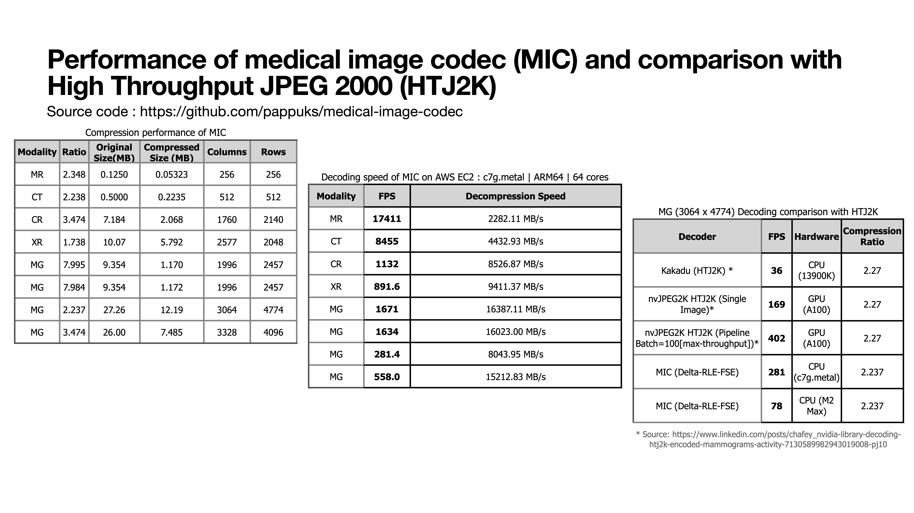

# MIC — Medical Image Codec

A **lossless compression codec for 16-bit DICOM images**, implemented in Go. MIC achieves JPEG 2000–comparable compression ratios with significantly higher decompression throughput — up to **16 GB/s** on large images.

| Branch | Status |
|--------|--------|
| main |  |

## Why MIC?

| Property | Value |
|----------|-------|
| Compression ratio | 1.7× – 8.9× (lossless) |
| Peak decompression speed | up to 16 GB/s (ARM64, 64 cores) |
| Supported bit depths | 8–16 bit greyscale |
| Multi-frame support | MIC2 container (random access or temporal prediction) |
| Browser support | JavaScript + WASM decoder included |

## Table of Contents

1. [Quick Start](#quick-start)
2. [Compression Pipeline](#compression-pipeline)
3. [Multi-Frame Support (MIC2)](#multi-frame-support-mic2)
4. [Algorithm Details](#algorithm-details)
5. [Compression Results](#compression-results)
6. [Benchmark Results](#benchmark-results)
7. [Browser Decoder](#browser-decoder)
8. [CLI Reference](#cli-reference)
9. [Comparison with HTJ2K](#comparison-with-htj2k)
10. [Roadmap](#roadmap)

---

## Quick Start

```bash
# Build the CLI tool
go build -o mic-compress ./cmd/mic-compress/

# Compress a single-frame DICOM
./mic-compress -dicom scan.dcm -output scan.mic

# Compress a multi-frame DICOM (e.g., Breast Tomosynthesis)
./mic-compress -dicom tomo.dcm -output tomo.mic

# Run all tests
go test -v ./...

# Run benchmarks
go test -bench=. -benchtime=10x
```

---

## Compression Pipeline

MIC chains four stages to compress 16-bit medical images:

```
Raw 16-bit Pixels
       │
       ▼
┌──────────────────────────────────────────┐
│           Delta Encoding                 │
│  Each pixel → value − avg(top, left)     │
│  Large diffs stored with an escape code  │
│  derived from the image bit depth        │
└─────────────────┬────────────────────────┘
                  │
                  ▼
┌──────────────────────────────────────────┐
│               RLE                        │
│  Same runs:  count + one repeated value  │
│  Diff runs:  count + N distinct values   │
│  Min run = 3 → output never larger       │
└─────────────────┬────────────────────────┘
                  │
          ┌───────┴───────┐
          │               │
          ▼               ▼
   ┌────────────┐  ┌────────────────┐
   │    FSE     │  │  Can. Huffman  │
   │ (ANS-based)│  │  (depth ≤ 14)  │
   │ Best speed │  │  Best ratio    │
   └─────┬──────┘  └───────┬────────┘
         └────────┬────────┘
                  │
                  ▼
          Compressed .mic file
```

> **Recommended:** Use `Delta + RLE + FSE` for production — it gives the best decompression throughput.
> Use `Delta + RLE + Huffman` if you need the smallest possible file size.

---

## Multi-Frame Support (MIC2)

MIC2 is a container format for multi-frame DICOM images (e.g., Breast Tomosynthesis / DBT).

### MIC2 File Layout

```
Byte offset   Field
────────────  ─────────────────────────────────────────
0  – 3        Magic: "MIC2"
4  – 7        Image width        (uint32 LE)
8  – 11       Image height       (uint32 LE)
12 – 15       Frame count        (uint32 LE)
16            Pipeline flags     bit0=spatial  bit1=temporal
17 – 19       Reserved
────────────  ─────────────────────────────────────────
20 – …        Frame offset table (N × 8 bytes each)
              └─ per entry: offset (uint32) + length (uint32)
────────────  ─────────────────────────────────────────
…             Frame 0 compressed data
              Frame 1 compressed data
              ⋮
              Frame N-1 compressed data
```

### Two Compression Modes

```
Independent Mode                   Temporal Mode
─────────────────────────────────  ─────────────────────────────────────────
Frame 0  →  Delta+RLE+FSE          Frame 0  →  Delta+RLE+FSE
Frame 1  →  Delta+RLE+FSE          Frame 1  →  ZigZag(residual)+RLE+FSE
Frame 2  →  Delta+RLE+FSE          Frame 2  →  ZigZag(residual)+RLE+FSE
  ⋮                                  ⋮
Frame N  →  Delta+RLE+FSE          Frame N  →  ZigZag(residual)+RLE+FSE

✓ Random access to any frame       residual = current frame − previous frame
✓ Best for spatially smooth data   ZigZag maps signed diff → unsigned
                                   ✓ Candidate for low-spatial-correlation data
```

### Multi-Frame Benchmark (69-frame Breast Tomosynthesis, 2457×1890, 10-bit)

| Mode | Raw Size | Compressed | Ratio |
|------|----------|------------|-------|
| Independent | 614 MB | 46.1 MB | **13.3×** |
| Temporal | 614 MB | 47.5 MB | 12.9× |

For smooth mammographic images the spatial predictor outperforms inter-frame prediction. Temporal mode may win on datasets with less spatial redundancy.

---

## Algorithm Details

### Delta Encoding

Encodes each pixel as its difference from the average of its top and left neighbors, transforming spatially correlated pixels into small, zero-clustered residuals.

```
          top
           │
  left ──► pixel  →  delta = pixel − avg(left, top)
```

Differences that exceed the threshold are stored verbatim, preceded by an escape delimiter whose value is derived from the image bit depth.

### RLE

Encodes the delta-coded stream as runs:

- **Same runs** — a count followed by a single repeated value (most common after delta coding)
- **Diff runs** — a count followed by that many distinct values

The minimum encoded run length is 3, guaranteeing the RLE output is never larger than the input.

### FSE (Finite State Entropy / ANS)

An [asymmetric numeral systems](https://en.wikipedia.org/wiki/Asymmetric_numeral_systems) entropy coder. MIC extends the reference implementation to support up to 65 535 distinct symbols (vs 4 095 in the original). The encoder writes **backwards**; the decoder reads **forwards**.

Key adaptive behavior: `tableLog` is automatically raised from 11 → 12 when symbol density is high (>128 distinct symbols, >32 samples each), yielding **4–7% better ratios** on CR and MG images.

### Canonical Huffman

An alternative entropy stage using [canonical Huffman codes](https://en.wikipedia.org/wiki/Canonical_Huffman_code). Symbol selection is capped iteratively so the tree depth stays ≤ 14 bits, keeping the codebook compact. Produces the smallest files but at lower decompression speed compared to FSE.

---

## Compression Results

`Delta + RLE + FSE` — all images are 16-bit greyscale DICOM. CT has the widest dynamic range (max value 65 535).

| Modality | Dimensions | Raw Size | Compressed | Ratio |
|----------|-----------|----------|------------|-------|
| MR | 256×256 | 0.13 MB | 0.053 MB | **2.35×** |
| CT | 512×512 | 0.50 MB | 0.22 MB | **2.24×** |
| CR | 2140×1760 | 7.18 MB | 1.98 MB | **3.63×** |
| XR | 2048×2577 | 10.1 MB | 5.79 MB | **1.74×** |
| MG1 | 2457×1996 | 9.35 MB | 1.09 MB | **8.57×** |
| MG2 | 2457×1996 | 9.35 MB | 1.09 MB | **8.55×** |
| MG3 | 4774×3064 | 27.3 MB | 12.2 MB | **2.24×** |
| MG4 | 4096×3328 | 26.0 MB | 7.49 MB | **3.47×** |

### Adaptive tableLog improvement

| Modality | Before | After | Gain |
|----------|--------|-------|------|
| CR | 3.47× | 3.63× | +4.4% |
| MG1 | 7.99× | 8.57× | +7.1% |
| MG2 | 7.98× | 8.55× | +7.1% |

### Wavelet+FSE vs Delta+RLE+FSE

A 5/3 integer wavelet transform was evaluated as an alternative decorrelation stage. **Delta+RLE+FSE wins on all DICOM modalities**, in both compression ratio and decompression speed. Full analysis: [docs/wavelet-fse-analysis.md](./docs/wavelet-fse-analysis.md).

#### Compression Ratio

| Modality | Delta+RLE+FSE | Wavelet+FSE | Wavelet+RLE+FSE |
|----------|:---:|:---:|:---:|
| MR (256×256) | **2.35×** | 2.09× | 2.09× |
| CT (512×512) | **2.24×** | 1.48× | 1.48× |
| CR (2140×1760) | **3.63×** | 2.59× | 2.59× |
| XR (2048×2577) | **1.74×** | 1.53× | 1.53× |
| MG1 (2457×1996) | **8.57×** | 4.91× | 7.28× |
| MG2 (2457×1996) | **8.55×** | 4.90× | 7.27× |
| MG3 (4774×3064) | **2.29×** | 1.90× | 1.93× |
| MG4 (4096×3328) | **3.47×** | 2.63× | 3.11× |

#### Decompression Speed (MB/s)

| Modality | Delta+RLE+FSE | Wavelet+FSE | Wavelet+RLE+FSE |
|----------|:---:|:---:|:---:|
| MR | 116 | **146** | 122 |
| CT | 165 | **168** | 142 |
| CR | **543** | 418 | 371 |
| XR | **605** | 576 | 486 |
| MG1 | **1 530** | 592 | 680 |
| MG2 | **1 493** | 618 | 644 |
| MG3 | **606** | 387 | 352 |
| MG4 | **1 054** | 480 | 579 |

---

## Benchmark Results

Benchmarks measure **decompression speed** — the primary use case is real-time rendering of compressed DICOM.

> **Note:** RAM speed has a larger impact than CPU clock speed. Machines with DDR5 RAM outperform older machines even at lower core counts.

```bash
# Run the benchmark
go test -benchmem -run=^$ -benchtime=200x -bench ^BenchmarkDeltaRLEFSECompress$ mic
```

### AWS c7g.metal — ARM64 | 64 cores

| Modality | FPS | Decompression Speed |
|----------|-----|---------------------|
| MR (256×256) | **17 411** | 2 282 MB/s |
| CT (512×512) | **8 455** | 4 433 MB/s |
| CR (2140×1760) | **1 132** | 8 527 MB/s |
| XR (2048×2577) | **892** | 9 411 MB/s |
| MG1 (2457×1996) | **1 671** | **16 387 MB/s** |
| MG2 (2457×1996) | **1 634** | 16 023 MB/s |
| MG3 (4774×3064) | **281** | 8 044 MB/s |
| MG4 (4096×3328) | **558** | 15 213 MB/s |

### AWS c7i.8xlarge — AMD64 | 32 cores (Intel Xeon Platinum 8488C)

| Modality | FPS | Decompression Speed |
|----------|-----|---------------------|
| MR | 8 714 | 1 142 MB/s |
| CT | 2 303 | 1 208 MB/s |
| CR | 421 | 3 172 MB/s |
| XR | 310 | 3 269 MB/s |
| MG1 | 532 | 5 220 MB/s |
| MG2 | 522 | 5 124 MB/s |
| MG3 | 121 | 3 468 MB/s |
| MG4 | 182 | 4 964 MB/s |

### AWS c7g.8xlarge — ARM64 | 32 cores

| Modality | FPS | Decompression Speed |
|----------|-----|---------------------|
| MR | 11 627 | 1 524 MB/s |
| CT | 4 170 | 2 186 MB/s |
| CR | 570 | 4 290 MB/s |
| XR | 432 | 4 562 MB/s |
| MG1 | 908 | 8 901 MB/s |
| MG2 | 803 | 7 879 MB/s |
| MG3 | 156 | 4 455 MB/s |
| MG4 | 262 | 7 132 MB/s |

### Mac Studio — Apple M2 Max | ARM64 | 12 cores

| Modality | FPS | Decompression Speed |
|----------|-----|---------------------|
| MR | 8 044 | 1 054 MB/s |
| CT | 2 137 | 1 121 MB/s |
| CR | 277 | 2 089 MB/s |
| XR | 199 | 2 101 MB/s |
| MG1 | 374 | 3 666 MB/s |
| MG2 | 373 | 3 659 MB/s |
| MG3 | 78 | 2 239 MB/s |
| MG4 | 117 | 3 188 MB/s |

---

## Browser Decoder

A browser-based decoder lives in [`web/`](./web/):

- **Pure JavaScript** ES module (~15 KB, zero dependencies)
- **Go WASM** build for maximum throughput
- Drag-and-drop `.mic` / `.mic2` file loading
- Window/Level controls for 16-bit diagnostic viewing
- **Multi-frame movie player** — play/pause, frame slider, configurable FPS, keyboard shortcuts (Space, ←/→)
- ~10–30 M pixels/s in JavaScript (V8), higher with WASM

See the **[Web Decoder README](./web/README.md)** for the full API reference and integration guide.

---

## CLI Reference

```bash
go build -o mic-compress ./cmd/mic-compress/

# Compress a raw binary image
./mic-compress -input image.bin -width 512 -height 512 -output image.mic

# Compress a single-frame DICOM → MIC1
./mic-compress -dicom scan.dcm -output scan.mic

# Compress a multi-frame DICOM (independent mode, default — random frame access)
./mic-compress -dicom tomo.dcm -output tomo.mic

# Compress a multi-frame DICOM (temporal prediction mode)
./mic-compress -dicom tomo.dcm -output tomo.mic -temporal

# Generate all test .mic files (single-frame + multi-frame)
./mic-compress -testdata
```

---

## Comparison with HTJ2K



---

## Roadmap

- [x] Browser-based decoding in JS and WASM — see [web decoder](./web/README.md)
- [x] Multi-frame image support (Breast Tomosynthesis) — MIC2 container with independent and temporal modes, browser movie player
- [x] Wavelet (5/3 integer) decorrelation stage — benchmarked; Delta+RLE+FSE wins for lossless; wavelet remains a candidate for a future lossy/progressive mode
- [ ] Implement suggestions from [Klaus Post](https://github.com/pappuks/medical-image-codec/issues/1)
