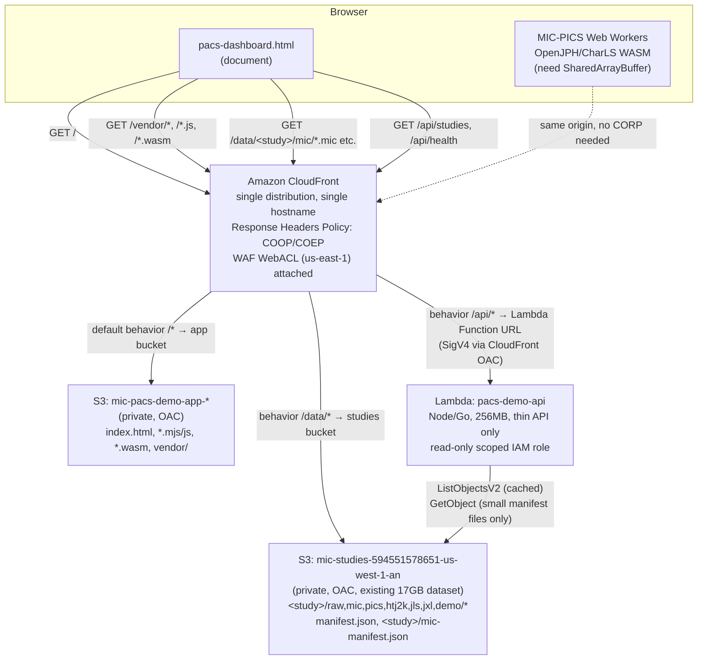

# PACS Web Viewer — Public Demo Hosting Design (AWS)

Status: **implemented in `infra/`** (SAM template, Lambda, WAF, deploy script)
and wired into the front-end via `web/pacs-study-source.mjs`. See
[`infra/README.md`](../infra/README.md) for the deploy guide. This document
remains the architecture reference. Target: `web/pacs-dashboard.html` and
friends, served publicly against the real S3 dataset in
`mic-studies-594551578651-us-west-1-an` (us-west-1).

## 1. Problem & Assumptions

**Goal.** Turn the local dev-server demo (`cd web && python3 serve.py`) into a
public, always-on online PACS web viewer: the browser loads the dashboard,
picks a study, and decodes MIC/PICS/HTJ2K/JPEG-LS blobs live, fetching them
from the S3 dataset instead of `web/testdata/`.

**Stated starting point.** The user asked for "a service running in a Lambda
function" that both hosts the front-end and reaches into S3. Section 2 takes
that literally, tests it against the actual constraints, and explains exactly
where and why the recommendation departs from it.

**Assumptions made explicit:**
- This is a public demo of already-public, CC-BY-licensed imagery (per
  `docs/pacs-s3-datasets.md`) — not a clinical or access-controlled PACS.
  Object-level access control beyond "don't let people scrape the whole 17 GB
  for free forever" is out of scope.
- The bucket (`mic-studies-594551578651-us-west-1-an`, 17K objects, 17 GB) is
  already populated by `scripts/pacs-ingest/upload_s3.py` and stays private
  (all four public-access-block flags `true`) — the design must not flip
  those.
- Region is us-west-1, co-located with the bucket, except where AWS mandates
  otherwise (CloudFront WAF web ACLs must live in `us-east-1` — noted in
  §9).
- The existing `pacs-dashboard.html` / `pacs-model.mjs` / `pacs-runner.mjs`
  benchmark harness is the viewer being hosted, not a rewrite. It needs a new
  "study source" concept (§7) to point at real study IDs instead of the
  hardcoded `testdata/` image set — that indirection is designed here but not
  implemented.
- No requirement was given for authentication, multi-region, or SLA. The
  design optimizes for "cheap, correct, boring" over "resilient at scale."

## 2. Is pure-Lambda the right fit? (recommendation up front)

**No — not for serving the front-end, and not for serving the blobs.**
Lambda is the right fit for exactly one thing here: a thin, stateless API.
Concretely:

| Literal ask | Recommendation | Why it deviates |
|---|---|---|
| Lambda hosts the HTML/JS/WASM | **S3 (private) + CloudFront static hosting** | The front-end is ~23 KB minified JS + a 2.5 MB Go WASM binary + ~2.4 MB of vendored OpenJPH/CharLS WASM (`web/vendor/`, checked with `du -sh`) — pure static bytes. Lambda has no benefit here and two real costs: (a) a Lambda Function URL response is capped at 6 MB buffered / 20 MB streamed — fine today, but it's a payload-size time bomb sitting under static assets that will only grow (more codecs, bigger WASM builds); (b) every asset request becomes a billed invocation instead of a free-tier-eligible S3 GET served from CloudFront's edge cache. CloudFront+S3 is *also* how you'd front a Lambda Function URL anyway (Lambda alone has no edge caching), so putting Lambda under it buys nothing and adds cold-start latency to page load. |
| Lambda serves the compressed DICOM/codec blobs from S3 | **CloudFront → S3 (OAC), Lambda not in the hot path** | Per-study raw DICOM is tens–hundreds of MB and a CT series is 500+ objects (constraint #2). A Lambda synchronous response tops out at 6 MB; API Gateway at 10 MB. Proxying blobs through Lambda is a hard functional blocker, not a style preference — most objects in this bucket simply cannot round-trip through a Lambda response body. |
| Lambda "accesses S3" | **Kept, narrowed to a thin API**: study listing (bucket is private, so a browser cannot `ListObjects` directly), health check, and abuse-guardrail hooks. Presigned-URL minting is designed but deliberately *not* the primary blob path (§6.2). | This is the one place Lambda is genuinely load-bearing: browsers can't enumerate a private bucket, and a static index file needs a compute path to stay fresh without a redeploy every time a study is ingested. |

The rest of this document designs around: **one CloudFront distribution, one
public hostname, three origins** (app-code S3 bucket, studies S3 bucket,
Lambda Function URL for `/api/*`), which — as §4 shows — also happens to be
the cleanest solution to the cross-origin-isolation constraint, not just the
cheapest one.

## 3. High-Level Architecture



Everything the browser talks to is **one hostname**
(`demo.mic-codec.example` or the default `*.cloudfront.net` domain). That
single fact is what makes §4 simple.

## 4. Cross-Origin Isolation: the header strategy

### 4.1 The requirement

`web/serve.py` already documents the local-dev version of this: the document
needs

```
Cross-Origin-Opener-Policy: same-origin
Cross-Origin-Embedder-Policy: require-corp
```

so that `SharedArrayBuffer` is available to the MIC-PICS Web Workers and the
OpenJPH/CharLS WASM decoders. Under `require-corp`, the browser blocks every
**cross-origin** subresource load unless that response carries
`Cross-Origin-Resource-Policy: cross-origin` (or `same-site`) — or unless the
resource is CORS-fetched with an explicit `Access-Control-Allow-Origin`.

### 4.2 The design choice: make it a non-problem, don't solve it per-object

The naive reading of constraint #1 is "tag every object in
`mic-studies-...` with a CORP header." That's real work (S3 doesn't let you
set arbitrary response headers per object at rest — you'd need a CloudFront
Response Headers Policy or a CloudFront Function on `origin-response`
touching every object response) and it's fragile: 17K existing objects plus
every future upload would need to go through a path that adds the header.

The single-distribution layout in §3 sidesteps this entirely.
**Same-origin resources are exempt from COEP's CORP/CORS check by spec** —
the browser only enforces CORP for resources it perceives as cross-origin.
Because the document, the JS/WASM, the DICOM/codec blobs, and the `/api/*`
responses are all fetched from the *same* CloudFront hostname, none of them
are cross-origin from the document's point of view, and `require-corp`
imposes no extra header requirement on them at all.

Concretely:

| Resource | Served from | Cross-origin to document? | CORP header needed? |
|---|---|---|---|
| `pacs-dashboard.html` | CloudFront `/` → app bucket | — (it's the document) | COOP+COEP set here |
| `mic-decoder.js`, `pacs-model.mjs`, `mic-decoder.wasm` | CloudFront `/` → app bucket | No | No |
| `vendor/openjph/*.wasm`, `vendor/charls/*.wasm` | CloudFront `/vendor/*` → app bucket | No | No |
| `<study>/mic/*.mic`, `<study>/raw/*.dcm`, `manifest.json` | CloudFront `/data/*` → studies bucket | No | No |
| `/api/studies` | CloudFront `/api/*` → Lambda Function URL | No | No |

We still **add `Cross-Origin-Resource-Policy: cross-origin` on the `/data/*`
and `/api/*` CloudFront behaviors as defense-in-depth** (one line in the
Response Headers Policy, costs nothing) — it's what makes the data safely
reusable if someone later wants to fetch it from a *different* origin (e.g.
a partner site embedding the viewer, or a future decoupled data CDN), without
having to revisit this decision under time pressure.

### 4.3 Where the headers are actually set

CloudFront **Response Headers Policy**, attached to every cache behavior
(default `/*`, `/data/*`, `/api/*`):

```
Cross-Origin-Opener-Policy:   same-origin
Cross-Origin-Embedder-Policy: require-corp
Cross-Origin-Resource-Policy: cross-origin
```

This replaces `web/serve.py`'s `end_headers()` override — the CloudFront
policy is the production equivalent of that dev-server shim. One header
policy, attached at the distribution level, is simpler and less error-prone
than trying to get S3 or Lambda to emit the same three headers consistently
across three different origins.

### 4.4 Rejected alternative: presigned S3 URLs / a separate data domain

If blobs were served via presigned URLs pointing directly at
`*.s3.us-west-1.amazonaws.com`, or via a second CloudFront distribution on a
different hostname, they would be genuinely cross-origin to the document.
That reintroduces the full CORP/CORS matrix: S3 bucket CORS rules for
preflight, plus a CloudFront Response Headers Policy (or Lambda@Edge /
CloudFront Function on `origin-response`) to inject `Cross-Origin-Resource-
Policy: cross-origin` on every object response, because S3 itself cannot set
arbitrary response headers on GetObject. It's solvable, but it's strictly
more moving parts for zero benefit here — see §6.2 for why presigned URLs
also lose on cost/latency grounds for this data shape.

## 5. Components & Responsibilities

| Component | Responsibility | Notes |
|---|---|---|
| **CloudFront distribution** | Single public entry point; TLS; edge caching; header injection (§4.3); WAF attachment; path-based routing to the three origins | One distribution, one domain — the load-bearing decision in this design |
| **App S3 bucket** (`mic-pacs-demo-app-<acct>-us-west-1`, new) | Hosts `pacs-dashboard.html`, `pacs-model.mjs`, `pacs-dashboard.mjs`, `pacs-runner.mjs`, `pacs-charts.mjs`, `mic-decoder*.js/.wasm`, `wasm_exec.js`, `web/vendor/*`, `web/codecs/*` | Private, OAC-only, deployed by CI (`aws s3 sync` of `web/` minus `node_modules`/`testdata`/`tests`) |
| **Studies S3 bucket** (`mic-studies-594551578651-us-west-1-an`, existing) | Holds the 17K-object dataset exactly as laid out today (constraint #4) | Unchanged; only the CloudFront OAC bucket policy is added — no public-access-block flags are touched |
| **Lambda: `pacs-demo-api`** | `GET /api/studies` (list + light filtering), `GET /api/health`, and the abuse-guardrail hook (§8) | Thin, stateless, no blob bytes ever pass through it (§6) |
| **CloudFront Response Headers Policy** | COOP/COEP/CORP injection (§4.3), cache-control defaults, security headers (`X-Content-Type-Options`, etc.) | Attached to all three behaviors |
| **WAF WebACL** (us-east-1, `CLOUDFRONT` scope) | Rate-based rule + AWS managed baseline rule group | See §8 |
| **CloudWatch** | Budget alarm on Lambda invocations + CloudFront data-transfer-out; access logs → S3 | Cost guardrail, not a product feature |

## 6. Data Path for Blobs

### 6.1 Recommended: CloudFront + Origin Access Control (OAC), no Lambda involvement

`/data/*` on the CloudFront distribution maps (with the `/data` prefix
stripped via Origin Path or a CloudFront Function) directly to the studies
bucket. The bucket stays fully private; only this CloudFront distribution's
OAC principal is allowed `s3:GetObject` (bucket policy, no ACLs). Because the
dataset is public-domain CC-BY imagery being demoed publicly, there is no
per-user access decision to make at request time — a static bucket policy
scoped to the distribution is sufficient and keeps every blob request off
the Lambda billing/latency path entirely.

- **Cache-hit path**: near-100% after warm-up for a fixed demo dataset —
  CloudFront edge cache serves repeat views of the same study for free
  (relative to S3 GET pricing) and with edge latency instead of a us-west-1
  round trip for non-US-West visitors.
- **Cost**: CloudFront data transfer out, no Lambda GB-seconds, no
  presigned-URL minting calls.
- **Latency**: one edge hop; no Lambda cold start or 4xx/redirect round trip
  before the byte stream starts.

### 6.2 Rejected as primary path: Lambda-minted presigned URLs

Presigning is the standard "keep a bucket private but let a browser fetch
it" pattern, and it was seriously considered because it's what "Lambda
accesses S3" most naturally suggests. It's rejected as the *primary* data
path for three concrete reasons tied to this dataset's shape:

1. **Fan-out cost.** A CT series is 500+ objects (constraint #2). Either the
   browser calls the presign endpoint once per object (500+ Lambda
   invocations to view one series) or Lambda pre-mints a batch, which just
   moves the same problem into a bigger Lambda response — and a batch of 500
   presigned URLs for a large series is itself tens of KB of JSON, adding
   avoidable latency before the first byte of image data even starts
   downloading.
2. **It reintroduces cross-origin.** A presigned URL points at
   `*.s3.us-west-1.amazonaws.com`, which is a different origin than the
   CloudFront demo hostname — undoing the "single origin, no CORP needed"
   simplification from §4.2 for every single blob fetch.
3. **No CDN caching.** Presigned URLs are per-request-signed and typically
   time-boxed; CloudFront can still cache the *response* keyed by URL, but
   every signature expiry forces a fresh presign round-trip, and a public
   demo re-showing the same handful of studies to many visitors gets no
   benefit from S3's request pricing the way an edge cache does.

Presigned URLs are kept in the design as an **optional, deferred** Lambda
endpoint (`POST /api/presign`) for a possible future "download this study's
original DICOM as a zip" convenience feature — a low-frequency, user-
initiated action where the fan-out and cross-origin cost of a handful of
presigned URLs is a non-issue. It is not wired into the default viewer path.

## 7. Front-End Change: Manifest / URL Indirection

This is the one piece of actual (deferred) implementation work the design
calls for — described here, not built.

**Today**: `web/pacs-runner.mjs` resolves every fetch relative to a
`baseUrl` parameter that already exists (`runBenchmark({ baseUrl, ... })`,
defaulting to `location.href`), via `candidatePaths()`, which hardcodes the
local benchmark's naming convention:

```js
// current — web/pacs-runner.mjs:24-34
if (codec.kind === 'mic' /* ... */) return [`testdata/${imgName}${codec.suffix}.mic`];
if (codec.kind === 'wasm') return [`testdata/${imgName}.${codec.ext}`];
```

and reads `testdata/manifest.json` / `testdata/refcodecs-manifest.json` for
checksums (`pacs-runner.mjs:153-154`). Both `web/pacs-model.mjs`'s `IMAGES`
and `CINE_DATASETS` arrays are keyed to the repo's small synthetic test set
(`MR`, `CT`, `CINE_MRCARD`, …) — not to the S3 bucket's real study IDs
(`<study-id>/raw/`, `<study-id>/{mic,pics,htj2k,jls,jxl}/`, per
`docs/pacs-s3-datasets.md`).

**Needed**: a `StudySource` indirection so the same decode/verify/benchmark
machinery in `pacs-runner.mjs` can point at either the local
`web/testdata/` set (dev, CI, Playwright — unchanged) or the deployed
`/data/<study-id>/...` layout (public demo), selected by a query param
(e.g. `?source=s3&study=<id>`):

- A new small module (e.g. `pacs-study-source.mjs`) exposing a path-resolver
  function shaped like today's `candidatePaths()` but driven by the real
  layout: `<study-id>/mic/<object>`, `<study-id>/pics/<object>`, etc.,
  plus a manifest reader that consumes the root `manifest.json` (written by
  `scripts/pacs-ingest/upload_s3.py:144-151`, containing `entries[].id`,
  `.tier`, `.license`, `.attribution`, `.representative.{modality,
  transfer_syntax_name, lossy}`) to populate a study picker in
  `pacs-dashboard.html`, and each study's own `mic-manifest.json` /
  `ref-manifest.json` (uploaded per-study, `upload_s3.py:134-142`) in place
  of the single global `testdata/manifest.json`.
- License/attribution surfacing (constraint #4: CC-BY requires credit) reads
  directly from that root `manifest.json` — no Lambda call needed, since
  `license`/`attribution`/`tier` are already flattened into it at ingest
  time and don't require reading S3 object user-metadata (`x-amz-meta-*`)
  back out at request time.
- `baseUrl` for the S3-backed mode becomes `https://<cloudfront-domain>/data/`
  instead of `location.href` + `testdata/` — the existing `new URL(path,
  baseUrl)` resolution in `fetchBytes`/`fetchJSON` (`pacs-runner.mjs:36-50`)
  needs no change; only what path template is asked for changes.
- The dashboard's existing "Image set" dropdown (`pacs-dashboard.html`,
  `#imageset`) gains a "Live S3 study" mode that lists studies from
  `/api/studies` (§8) or straight from `manifest.json`, and a per-study
  license/attribution banner.

This keeps `pacs-runner.mjs`'s timing/verification/adapter logic — the part
that actually matters for the benchmark's integrity — completely untouched;
only the path-resolution layer grows a second implementation.

## 8. Minimal Lambda API

Three routes, one function, no framework:

| Route | Method | Purpose | Backing call |
|---|---|---|---|
| `/api/health` | GET | Liveness/readiness for uptime checks | none — static 200 |
| `/api/studies` | GET | List studies with metadata for the picker, with optional `?modality=` / `?tier=` filtering; result cached (in-memory + short CloudFront TTL) | `s3:ListObjectsV2` (delimiter `/`) + read of root `manifest.json`, or (simpler, recommended default) just proxy-and-filter the already-flattened root `manifest.json` — see below |
| `/api/presign` *(deferred, not wired into the default viewer path — §6.2)* | POST | Mint short-TTL presigned GET URLs for a bulk "download original study" feature | `s3:GetObject` presign, no bucket listing |

**Simplification worth calling out**: since `manifest.json` at the bucket
root already contains every field the study picker needs (§7), `/api/studies`
can be implemented as "fetch and filter that one JSON object" rather than a
live `ListObjectsV2` walk of 17K objects. A live listing is only worth the
extra IAM permission and latency if studies are expected to be added to the
bucket *without* re-running the ingest pipeline's manifest write — recommend
starting with the manifest-proxy version and only adding `ListObjectsV2` if
that assumption breaks in practice. Either way, this stays a GET of a
kilobyte-scale JSON file, never a blob.

**Runtime**: Go (`provided.al2023` custom runtime or `arm64` Go build) to
match the rest of the codebase and get fast cold starts; a Node 20.x handler
is an equally fine, more conventional choice if the team prefers not to
maintain a second Go build target just for this. Either way: 256 MB memory,
10s timeout, no VPC (no need — it only talks to S3 and CloudWatch, both
reachable without VPC networking, and a VPC would add a cold-start ENI
penalty for nothing).

**Invocation path**: Lambda Function URL, auth type `AWS_IAM`, invoked only
by CloudFront via **Origin Access Control for Lambda Function URLs** (SigV4
signing) — this blocks the raw `*.lambda-url.us-west-1.on.aws` endpoint from
being called directly, so `/api/*` is only reachable through the
distribution that also applies the COOP/COEP/CORP policy and the WAF rules.
API Gateway was considered and rejected as unnecessary — three routes with
no auth model, no request validation, and no need for its throttling (WAF
covers that, §9) don't justify its added latency and cost over a Function
URL.

## 9. IAM

The current AWS credentials in use are root-account keys — out of scope to
fix here beyond flagging it, but the Lambda execution role must **not**
inherit that shape. One purpose-built, least-privilege role:

```
Role: pacs-demo-api-execution-role
Trust: lambda.amazonaws.com

Policy (inline, scoped to this bucket only):
  - s3:GetObject   on arn:aws:s3:::mic-studies-594551578651-us-west-1-an/manifest.json
                    and arn:aws:s3:::mic-studies-594551578651-us-west-1-an/*/mic-manifest.json
                    and arn:aws:s3:::mic-studies-594551578651-us-west-1-an/*/ref-manifest.json
  - s3:ListBucket  on arn:aws:s3:::mic-studies-594551578651-us-west-1-an
                    (only if the ListObjectsV2 fallback in §8 is implemented;
                     omit entirely for the manifest-proxy default)
  - s3:GetObject   on arn:aws:s3:::mic-studies-594551578651-us-west-1-an/*
                    (only if /api/presign is implemented — scope to the
                     specific study prefix requested, not bucket-wide, via
                     a runtime-constructed ARN condition or per-request
                     resource check)
  - logs:CreateLogGroup / CreateLogStream / PutLogEvents
                    on this function's log group only

No s3:PutObject, s3:DeleteObject, or write permissions anywhere.
No access to any bucket other than mic-studies-594551578651-us-west-1-an.
```

CloudFront's two S3 origins get their own resource-based bucket policies
(not IAM roles) restricted to `AWS:SourceArn` = this distribution's ARN, via
OAC — standard pattern, no new credential to manage.

**Note on WAF and region**: a WAFv2 WebACL with `Scope: CLOUDFRONT` must be
created in `us-east-1` regardless of where the distribution's origins live
— an AWS-wide quirk, not a choice made here. The rest of the stack (Lambda,
both S3 buckets) stays in us-west-1 alongside the existing bucket.

## 10. Deployment / IaC

**Recommendation: AWS SAM.** The stack is small (2 S3 buckets, 1 Lambda, 1
CloudFront distribution, 1 Response Headers Policy, 1 OAC, 1 WAF WebACL) and
entirely serverless — SAM's `AWS::Serverless::Function` plus a handful of
plain CloudFormation resources (`AWS::CloudFront::Distribution`,
`AWS::S3::Bucket`, `AWS::WAFv2::WebACL`) covers it in one template with `sam
build && sam deploy` and no state-file management story to run (unlike
Terraform) or a second language runtime to install (unlike CDK). CDK is a
reasonable alternative if the team already uses it elsewhere in this repo —
nothing here found evidence of existing IaC (`find` for `*.tf`/CDK/SAM
templates came back empty), so this is a green-field IaC choice, not a
migration.

**Minimal resource inventory:**

```yaml
# template.yaml (SAM) — resource list, not full implementation
Resources:
  AppBucket:            AWS::S3::Bucket        # mic-pacs-demo-app-<acct>-us-west-1, private
  AppBucketPolicy:       AWS::S3::BucketPolicy # allow only the distribution's OAC principal
  StudiesBucketPolicy:   AWS::S3::BucketPolicy # added to the EXISTING studies bucket; grants OAC read-only
  OriginAccessControlApp:     AWS::CloudFront::OriginAccessControl
  OriginAccessControlStudies: AWS::CloudFront::OriginAccessControl
  ApiFunction:           AWS::Serverless::Function  # pacs-demo-api, Function URL, AWS_IAM auth
  ApiFunctionOAC:         AWS::CloudFront::OriginAccessControl  # for the Lambda Function URL origin
  ResponseHeadersPolicy: AWS::CloudFront::ResponseHeadersPolicy  # COOP/COEP/CORP + security headers
  Distribution:           AWS::CloudFront::Distribution
                           # origins: AppBucket, StudiesBucket (existing), ApiFunction URL
                           # behaviors: /* -> App, /data/* -> Studies, /api/* -> ApiFunction
  WebACL:                 AWS::WAFv2::WebACL      # us-east-1 stack, Scope: CLOUDFRONT (separate template)
  ExecutionRole:           AWS::IAM::Role          # scoped per §9 (SAM auto-generates a base role; tighten it)
  AccessLogsBucket:       AWS::S3::Bucket        # CloudFront + S3 access logs, short lifecycle rule
  BudgetAlarm:             AWS::CloudWatch::Alarm  # cost guardrail, §11
```

Two stacks: one in `us-east-1` for the WAF WebACL (AWS requirement), one in
`us-west-1` for everything else, with the WebACL ARN passed into the
`us-west-1` stack as a parameter (cross-region WAF-for-CloudFront association
is exactly this two-stack shape in every existing SAM/CDK/Terraform recipe
for this problem — not a novelty here).

Deployment of the app bucket's contents (`web/*.html/.mjs/.js/.wasm`,
`web/vendor/`) is a plain `aws s3 sync` step in CI after `sam deploy`, not a
CloudFormation-managed asset — matches how `scripts/pacs-ingest/upload_s3.py`
already treats the studies bucket as sync target, not IaC-managed content.

## 11. Cost Sketch

Rough order-of-magnitude for a public demo with light-to-moderate traffic
(order of hundreds of viewer sessions/month, each browsing a few studies):

| Item | Driver | Approx. monthly cost |
|---|---|---|
| CloudFront data transfer out | Dominant cost. Dozens of GB/month at typical demo traffic; CloudFront US/EU tiers ~$0.085/GB after free tier | $5–40, scales linearly with traffic — see §12 for the cap that bounds this |
| CloudFront requests | Millions of free-tier requests/month cover this comfortably | ~$0 |
| S3 storage (studies bucket) | 17 GB, already provisioned, unaffected by this design | ~$0.40/mo (unchanged, sunk cost) |
| S3 storage (app bucket) | ~5 MB of JS/WASM | ~$0 |
| S3 GET requests (cache misses only, since OAC origin is behind CloudFront) | Cache-hit ratio should be high for a fixed demo set after warm-up | ~$1–5 |
| Lambda invocations + GB-seconds | Only `/api/studies` and `/api/health`, kilobyte responses, sub-100ms | ~$0 (well within free tier) |
| WAF WebACL | Fixed $5/mo + $1/mo per rule + $0.60/million requests | ~$6–8 |
| **Total** | | **roughly $15–55/month**, dominated by data egress and bounded by §12's guardrails |

The 17 GB dataset itself is a one-time-ish storage cost already sunk; the
variable cost that actually needs watching is **egress from repeat viewers
re-downloading the same large series**, which is exactly what CloudFront
caching (§6.1) is there to blunt.

## 12. Public-Demo Abuse Concerns / Guardrails

A public endpoint over 17 GB of free-to-browse data invites both accidental
(a crawler indexing every object) and deliberate (someone scripting a full
bucket mirror) abuse. Guardrails, proportionate to a demo rather than a
production PACS:

1. **CloudFront caching absorbs repeat load for free** — the highest-value
   guardrail and already designed in (§6.1). Set `Cache-Control:
   public, max-age=86400, immutable` on `/data/*` responses (content-
   addressed by study ID + codec, effectively immutable) via the Response
   Headers Policy.
2. **WAF rate-based rule**: cap requests per IP over a 5-minute window (e.g.
   2000 requests/5min — generous for a real viewer session loading a large
   series, restrictive for a scripted full-bucket walk) — block/challenge on
   breach. Layer AWS's managed `AWSManagedRulesCommonRuleSet` and
   `AWSManagedRulesKnownBadInputsRuleSet` underneath for baseline bot/exploit
   coverage at negligible extra cost.
3. **No bucket enumeration surface**: `/api/studies` returns only the
   curated `manifest.json` entries, never a raw `ListObjectsV2` dump of
   every codec/tile object — a scraper has to know or guess individual
   object keys to bulk-pull raw bytes, and CORS/CORP is same-origin-only so
   a third-party page can't easily launch pulls from a visitor's browser
   either.
4. **CloudWatch budget alarm** (§10's `BudgetAlarm`) on CloudFront
   `BytesDownloaded` and Lambda `Invocations`, alarming well below the
   monthly figures in §11 — a cheap tripwire for "someone found the demo and
   is mirroring it," not a hard cutoff (a hard cutoff on a public demo just
   turns a cost problem into a "the demo is down" problem; alerting lets a
   human decide).
5. **Explicitly not doing**: per-user auth, CAPTCHA, or a request quota
   enforced in Lambda (constraint: Lambda isn't in the blob hot path, so it
   has nothing to meter) — all disproportionate to "public demo of public
   data." If usage patterns later show this isn't enough, CloudFront's rate
   limiting can be tightened before reaching for anything heavier.

## 13. Risks, Edge Cases & Mitigations

| Risk | Mitigation |
|---|---|
| CloudFront edge cache serves a stale `manifest.json` after a bucket re-ingest | Short TTL (e.g. 5 min) specifically on `manifest.json`/`*-manifest.json` paths via a dedicated cache behavior or `Cache-Control` on those objects at upload time; long TTL only on immutable codec blobs |
| A study's `/data/<id>/...` prefix is requested before that study finishes uploading (partial ingest) | `upload_s3.py` already writes a `.complete`/`.unzipped` sentinel pattern locally; extend `/api/studies` to only list studies whose ingest is confirmed complete (a per-study `_complete` marker object, or simply requiring the study to appear in the root `manifest.json`, which is written last per `upload_s3.py:144-151`) |
| Someone points a browser at the raw CloudFront `/data/*` path directly (bypassing the app) to bulk-download | Acceptable for this dataset (public CC-BY data, no confidentiality requirement) — not treated as a security issue, only a cost one, covered by §12 |
| Lambda Function URL's OAC-for-Lambda feature (relatively recent CloudFront capability) unavailable in the deploying account/region | Fallback: API Gateway HTTP API with a resource policy restricted to the CloudFront distribution's managed prefix list, same effective protection, marginally more cost |
| Root `manifest.json` grows large enough that shipping it whole to every browser is wasteful | Not a concern at today's ~17K objects / dozens-to-low-hundreds of studies; if it becomes one, `/api/studies` switching from "proxy the file" to "query a small DynamoDB table" is a contained, additive change — not a re-architecture |
| New codec/WASM assets added to `web/vendor/` in the future need a CORP header if ever served cross-origin | Not applicable under the single-origin design (§4.2); only becomes relevant if a future decision moves data to a separate domain, at which point §4.4's rejected-alternative header strategy is the fallback plan, already written down |

## 14. Alternatives Considered — Summary Tradeoff Table

| Alternative | Verdict | Why |
|---|---|---|
| **Single CloudFront distribution, path-routed to S3 (app) + S3 (data) + Lambda (api)** | **Recommended** | Same-origin by construction (§4.2) eliminates the CORP-per-object problem; static assets served at S3/CDN cost, not Lambda cost; blobs never hit Lambda's payload ceiling; Lambda kept for the one thing only it can do (private-bucket listing without a public ListBucket grant) |
| Lambda Function URL serves the HTML/JS/WASM directly | Rejected | 6 MB (buffered) / 20 MB (streamed) response caps sit uncomfortably close to the 2.5 MB WASM binary today and will bite as more codec WASM is vendored; no edge caching without putting CloudFront in front anyway, at which point Lambda adds cold-start latency and per-request billing to what should be a free static GET |
| S3 static website hosting (S3 website endpoint, no CloudFront) | Rejected | S3 website endpoints don't support HTTPS or per-response custom headers (no way to inject COOP/COEP), and the bucket would need to be public — violates "keep it private" and can't satisfy constraint #1 at all |
| Presigned URLs (Lambda-minted) as the primary blob path | Rejected as primary, kept as optional deferred feature | 500+ objects/series makes per-object presign fan-out expensive; reintroduces cross-origin (undoes §4.2); no CDN cache benefit for a public demo re-showing the same studies (§6.2) |
| Lambda@Edge / CloudFront Functions for header injection | Rejected in favor of a plain Response Headers Policy | A native CloudFront Response Headers Policy does exactly this with zero compute, zero cold start, and no code to maintain — Lambda@Edge is the right tool when you need per-request *logic*, not for three static header lines |
| Two separate CloudFront distributions (app domain + data domain) | Rejected | Reintroduces the cross-origin CORP/CORS matrix this design exists to avoid, for no offsetting benefit given both origins are equally cacheable under one distribution |
| API Gateway (REST/HTTP API) in front of the Lambda | Rejected, noted as fallback | Three unauthenticated routes with no request validation don't need API Gateway's feature set; a Function URL with CloudFront-OAC SigV4 gating is strictly simpler and cheaper for this shape — revisit only if OAC-for-Lambda proves unavailable (§13) |

## 15. Implementation Notes / Next Steps

This design is ready to hand off for implementation. Suggested sequencing:

1. **SAM template** (§10) for the `us-west-1` stack (S3 app bucket, OACs,
   Response Headers Policy, Lambda + Function URL, CloudFront distribution
   with the three behaviors) and the separate `us-east-1` WAF stack.
2. **`/api/health` and `/api/studies` (manifest-proxy variant)** — the
   minimum viable Lambda, no `ListObjectsV2` permission needed yet.
3. **`pacs-study-source.mjs`** (§7) — the new path-resolver + study-picker
   wiring in the front-end, gated behind `?source=s3`, leaving the existing
   `testdata/`-based dev/CI/Playwright flow untouched.
4. **CI deploy step**: `aws s3 sync web/ s3://mic-pacs-demo-app-.../ --exclude
   node_modules --exclude testdata --exclude tests` + CloudFront
   invalidation on the app-bucket paths only (leave `/data/*` cache alone).
5. **WAF + budget alarm** (§9, §12) before announcing the demo publicly, not
   after.
6. Defer `/api/presign` (§6.2) until/unless a "download original study" UI
   feature is actually requested.

Files referenced in this design: `web/serve.py`, `web/pacs-dashboard.html`,
`web/pacs-model.mjs`, `web/pacs-runner.mjs`, `web/vendor/`,
`docs/pacs-s3-datasets.md`, `scripts/pacs-ingest/upload_s3.py`,
`scripts/pacs-ingest/pacs_ingest.py`.
