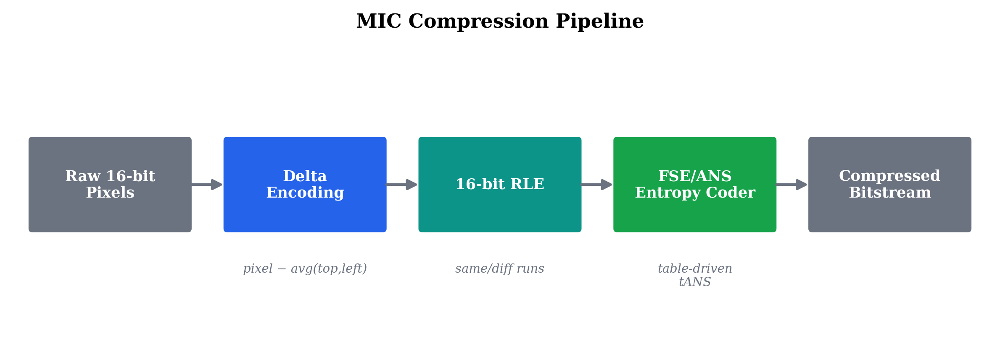
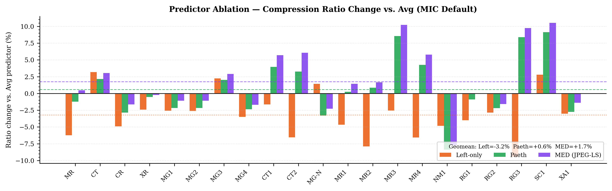
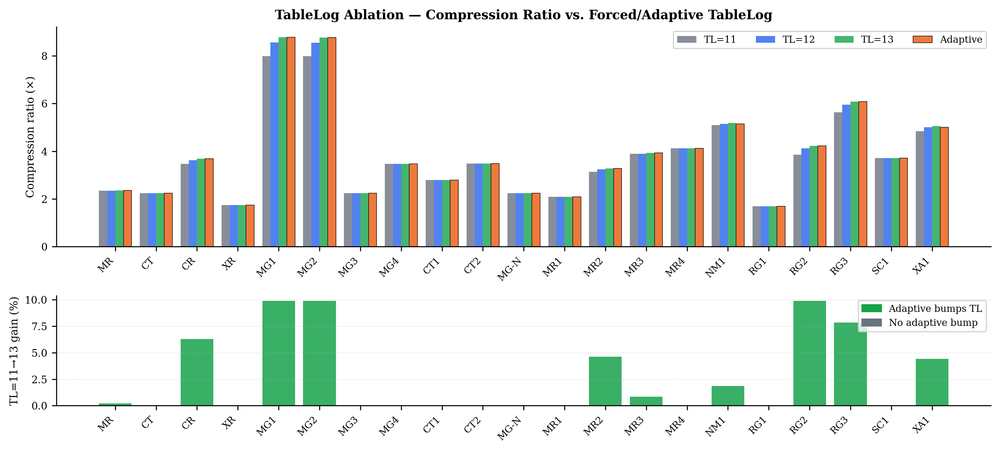
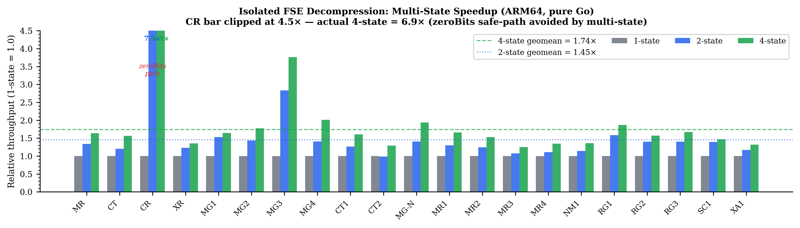
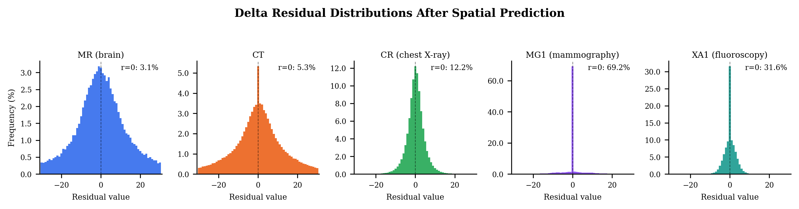
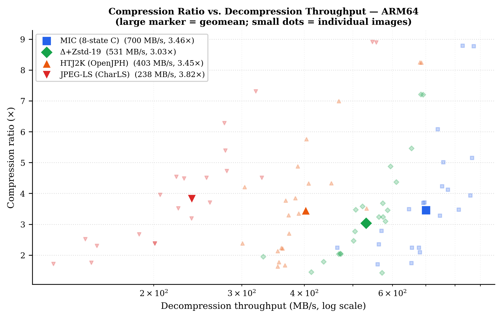

# A 16-Bit-Native Entropy Coding Pipeline for Lossless Medical Image Compression

**Kuldeep Singh**  
Innovaccer Inc.  
kuldeep.singh@innovaccer.com  
Code: https://github.com/pappuks/medical-image-codec

---

## Abstract

Lossless compression remains important in medical imaging because archival storage, transmission, and diagnostic workflows often require exact reconstruction of high-bit-depth pixel data. Many medical images are stored at 10--16 bits per sample, yet most practical compression software remains optimized for byte-oriented processing or small symbol alphabets. This paper studies a lossless compression pipeline designed to operate natively on predicted 16-bit residuals.

We present MIC, a codec consisting of three stages: spatial prediction, 16-bit run-length encoding, and large-alphabet table-based asymmetric numeral system (ANS) coding. The implementation extends FSE-style entropy coding to support large active symbol sets arising in medical image residual streams and includes a multi-state interleaved decoder that increases instruction-level parallelism during decompression. The design is motivated by the observation that, after simple spatial prediction, many medical images produce residual distributions sharply concentrated near zero with frequently repeated 16-bit residual values.

We evaluate the proposed codec on 21 de-identified DICOM images spanning MR, CT, CR, X-ray, mammography, nuclear medicine, radiography, secondary capture, and fluoroscopy. On the evaluated dataset, the 16-bit-native pipeline improves compression ratio by 5--22% (geometric mean +14%) relative to a delta + Zstandard baseline. Across grayscale images, MIC achieves lossless compression ratios ranging from 1.7× to 8.9×. A four-state interleaved entropy decoder provides 66--142% decompression speedup over a single-state implementation without affecting compressed size. On the reported ARM64 and AMD64 platforms, the fastest MIC variant exceeds HTJ2K decompression speed on 19/21 images single-threaded (ARM64) and 16/21 (AMD64); strip-parallel configurations exceed HTJ2K on all 21 images on both platforms.

A compact JavaScript implementation (~20 KB, zero dependencies) and a Go WebAssembly build demonstrate that the core decoding pipeline is lightweight enough for client-side deployment. These results suggest that 16-bit-native entropy coding is a useful design point for lossless medical image compression when decompression throughput, implementation simplicity, and deployment portability are important.

[TODO: Add shuffle/bitshuffle-based general-purpose baselines, browser benchmarks using Web Workers, and confidence intervals for all timing results in the final submission.]

**Index Terms** -- medical image compression, lossless compression, entropy coding, ANS, FSE, DICOM, high-bit-depth imaging.

---

## I. Introduction

Medical imaging systems routinely generate large volumes of high-bit-depth data. Modalities such as computed tomography (CT), magnetic resonance imaging (MR), digital radiography (CR/XR), mammography, and tomosynthesis commonly store pixel values at 10, 12, or 16 bits per sample. A single digital breast tomosynthesis (DBT) acquisition view produces 60 or more reconstructed slices -- e.g., 69 frames at 2457×1890 pixels, 10-bit depth -- totalling over 600 MB of raw pixel data per view. A complete bilateral four-view screening study exceeds 2 GB uncompressed. Efficient lossless compression is essential for archival storage, network transmission, and real-time rendering in clinical PACS and diagnostic viewers.

DICOM supports several established lossless transfer syntaxes, including JPEG 2000, HTJ2K, JPEG-LS, and RLE Lossless. These methods offer different tradeoffs among compression ratio, decoding speed, and implementation complexity. JPEG 2000 and HTJ2K provide strong compression performance but rely on transform and block-coding pipelines that are comparatively complex. JPEG-LS uses predictive coding and often yields strong lossless ratios, but its throughput characteristics remain application-dependent. RLE Lossless is simple but typically provides limited compression because it operates on byte-oriented runs and does not include an effective decorrelation stage.

This work studies a different design point for lossless medical image compression: direct coding of **predicted 16-bit residual streams**. The central observation is that the dominant entropy coders in modern compression systems -- Huffman, arithmetic coding, LZ77, and FSE/ANS as used in Zstandard -- were designed for 8-bit byte streams. Medical images break this assumption: DICOM stores pixels at 10--16 bits per sample, yielding symbol alphabets of 1,024 to 65,536 entries. Even after spatial delta prediction, the residual alphabet for a 16-bit CT image can span tens of thousands of distinct values. An entropy coder that assumes an 8-bit alphabet must either re-encode 16-bit symbols as byte pairs (losing inter-byte correlation and doubling the number of coding steps) or truncate the alphabet at 256 and fall back to raw storage for rare symbols. This mismatch is not merely inconvenient but structurally costly: byte-splitting a 16-bit residual distribution discards mutual information between the high and low bytes, inflating compressed output by 10--22% compared to a 16-bit-native entropy coder.

Based on this observation, we present MIC, a lossless codec that combines:
1. a simple spatial predictor,
2. a 16-bit-native run-length representation of the residual stream, and
3. an extended FSE/tANS entropy coder supporting large active symbol alphabets.

The codec also includes multi-state interleaved entropy decoding to improve decompression throughput by increasing instruction-level parallelism.

The paper is motivated by three practical questions:

1. Can a 16-bit-native entropy coding pipeline improve compression efficiency over byte-oriented baselines on medical residual streams?
2. Can entropy-decoder organization be modified to improve throughput without changing compressed size?
3. Can such a codec remain compact enough for lightweight deployment, including client-side decoding?

### A. Contributions

The main contributions of this paper are as follows.

1. **A 16-bit-native lossless coding pipeline for medical images.**
   We present a Delta + 16-bit RLE + extended FSE pipeline for grayscale medical image compression that outperforms Delta+Zstandard by 5--22% (geometric mean +14%) on all 21 tested images.

2. **An extended table-based entropy coder for large residual alphabets.**
   The proposed implementation supports up to 65,535 distinct symbols while dynamically sizing working tables to the observed symbol range, reducing working-set size from 512 KB to approximately 2 KB for 8-bit images.

3. **A multi-state interleaved entropy decoder.**
   We implement and evaluate two-state and four-state FSE decoding to exploit instruction-level parallelism, achieving 66--142% isolated FSE speedup with no compression ratio penalty.

4. **An empirical evaluation against standard codecs and a general-purpose baseline.**
   We compare MIC with HTJ2K (OpenJPH), JPEG-LS (CharLS), and delta + Zstandard on a dataset of 21 public de-identified DICOM images spanning 10 modalities, using fair in-process benchmarking via CGO bindings.

5. **A compact JavaScript/WASM decoder implementation.**
   We provide a ~20 KB pure JavaScript decoder and a Go WebAssembly build to explore deployment feasibility for client-side viewing.

[TODO: Add real browser benchmarks with Web Workers for the final submission; current parallel results are primarily Node.js measurements.]

### B. Scope

The primary focus of this paper is **lossless grayscale medical image compression**. Multi-frame grayscale (MIC2) and single-frame RGB support (MICR) are included as secondary studies demonstrating extensibility. The present work does not address lossy coding, progressive decoding, or region-of-interest coding.

### C. Organization

Section II reviews related work and positions MIC relative to existing methods. Section III describes the proposed coding pipeline. Section IV presents the multi-state entropy decoder. Section V describes experimental methodology. Section VI reports compression and speed results. Section VII discusses limitations and implications. Section VIII concludes.

---

## II. Related Work

### A. Lossless Compression in Medical Imaging

JPEG 2000 Part 1 [2] employs the reversible 5/3 integer wavelet transform with embedded block coding (EBCOT). It achieves excellent compression ratios but its bit-plane coding and context modeling impose significant computational overhead during decompression. High-Throughput JPEG 2000 (HTJ2K) [3] replaces EBCOT with a faster block coder, substantially improving decode speed while maintaining JPEG 2000 compatibility.

JPEG-LS [4] uses context-adaptive prediction (MED predictor) followed by Golomb-Rice coding. It provides fast encoding and decoding with strong compression ratios -- in our evaluation, JPEG-LS achieves the highest lossless ratio on 21/21 tested images. JPEG-LS is well-suited to smooth images but its prediction model is fixed and its throughput characteristics are application-dependent.

RLE Lossless (DICOM Transfer Syntax 1.2.840.10008.1.2.5) uses byte-level PackBits run-length encoding. It is trivially simple but achieves poor compression ratios (typically <1.5×) because it operates on bytes rather than 16-bit pixel values and lacks any decorrelation stage.

These standards are important baselines for the present work. The goal of this paper is not to argue that they are obsolete, but to investigate a simpler residual-domain design targeted specifically at high-bit-depth images with strong throughput characteristics.

### B. Entropy Coding and the Byte Assumption

Asymmetric numeral systems (ANS) [7,8] generalize arithmetic coding into a single-state machine that replaces interval subdivision with integer state transitions. Finite State Entropy (FSE) [9] is a table-driven tANS implementation that achieves near-optimal compression with O(1) per-symbol operations. FSE was popularized by Zstandard [10]. Recent theoretical analyses have formalized ANS efficiency bounds [13] and provided statistical interpretations of the coding process [14].

Traditional arithmetic coding achieves near-optimal compression but is inherently sequential. Mahapatra and Singh [12] addressed this with a parallel-pipelined FPGA implementation, demonstrating that hardware acceleration can overcome the throughput limitations of sequential arithmetic coders.

In practice, most of these coders are designed around small alphabets. Huffman coding becomes impractical above ~4,096 symbols. FSE in Zstandard caps at 4,096. The predominant implementations are optimized for byte-oriented data.

Medical images differ in that they naturally contain 10--16 bit sample values. After prediction, the residual stream may still be more naturally modeled as a sequence of 16-bit symbols. This creates a modeling choice: preserve the residual stream as word-level symbols, or transform it into bytes and rely on later processing to recover cross-byte structure.

**The information-theoretic cost of byte-splitting.** Consider a 16-bit symbol X decomposed into its high byte X_H and low byte X_L. A byte-level coder that processes X_H and X_L independently achieves at best H(X_H) + H(X_L) = H(X) + I(X_H; X_L), where I(X_H; X_L) is the mutual information between the two bytes. For medical image residuals after delta prediction, when a residual is small (say, ± 30), the high byte is nearly deterministic given the low byte -- yet a byte-level coder must still encode it. On our test images, I(X_H; X_L) ranges from 0.3 bits/symbol (MR) to 1.1 bits/symbol (MG3), corresponding to 8--22% of the total entropy and closely matching the 5--22% empirical advantage of MIC over Delta+Zstandard (geometric mean +14%).

[TODO: Add direct comparisons to byte-shuffle and bitshuffle preprocessing (e.g., delta + byte-shuffle + Zstandard, delta + bitshuffle + Zstandard), since these are strong baselines for multibyte numerical data that partially address the byte-splitting cost.]

### C. ANS and Interleaved Decoding

Prior work has shown that interleaving or multi-stream organization can improve ANS decoder throughput. Giesen [15,16] demonstrated the value of multi-stream rANS; Lin *et al.* [17] extended parallel rANS to decoder-adaptive scalability; Weissenberger and Schmidt [18] showed massively parallel ANS decoding on GPUs. The present work does not claim novelty in ANS itself or in interleaving as a general concept. Rather, the contribution lies in applying these ideas in a 16-bit-native medical image codec, together with a specific large-alphabet implementation and throughput-oriented software design.

### D. Positioning of This Work

Table I distinguishes MIC from prior work across five dimensions relevant to medical image compression.

| Feature | JPEG-LS [4] | HTJ2K [3] | Zstandard [10] | Interleaved rANS [15,17] | MIC (this work) |
|---------|:-----------:|:---------:|:--------------:|:------------------------:|:---------------:|
| Lossless medical imaging | Yes | Yes | General-purpose | General-purpose | Yes |
| Native 16-bit alphabet | No (Golomb-Rice) | No (bit-plane) | No (max 4,096) | Configurable | Yes (up to 65,535) |
| Multi-state ILP decoder | No | No | No | Yes (rANS) | Yes (tANS/FSE) |
| Browser-native decoder | No | No | Partial [36] | No | Yes (~20 KB JS) |
| Implementation complexity | ~5,000 LOC | ~20,000 LOC | N/A | N/A | ~1,100 LOC |

*Table I: Feature comparison of MIC with related codecs and entropy coding methods.*

[TODO: Add shuffle/bitshuffle scientific-data pipelines (e.g., HDF5 filters, Blosc) as an additional column. Add references on scientific-data compression and large-alphabet entropy coding.]

---

## III. Proposed Method

MIC compresses grayscale images using three sequential stages: spatial prediction, 16-bit run-length encoding, and large-alphabet table-based entropy coding. Each stage is simple enough to decode in a single sequential pass with minimal branching.

*Fig. 1: MIC compression pipeline — Raw 16-bit pixels are delta-encoded (avg of top and left neighbors), run-length encoded (same/diff runs), and entropy-coded with a 16-bit-native FSE/tANS coder.*

### A. Spatial Prediction

Let x(i,j) denote the pixel at row i, column j. For interior pixels, MIC predicts the current pixel from the average of the top and left neighbors:

    x̂(i,j) = ⌊ (x(i-1,j) + x(i,j-1)) / 2 ⌋

and forms the residual:

    r(i,j) = x(i,j) - x̂(i,j).

Boundary pixels use only the available neighbor, and the first pixel is stored directly.

This predictor was selected because it is computationally simple, branch-light in decoding, and effective on the current dataset.

**Predictor comparison.** We implemented and compared four predictors through the full RLE+FSE pipeline on the 21-image dataset: left-only (left neighbor, no top), average (MIC default), Paeth (PNG predictor [28]), and MED (JPEG-LS [4]). Table II presents per-image ratios; Table IIb summarizes geometric means and relative gains.

| Image | Left-only | Avg (MIC) | Paeth | MED (JLS) | Avg→Paeth | Avg→MED |
|-------|:---------:|:---------:|:-----:|:---------:|:-------------:|:-----------:|
| MR    | 2.21× | **2.35×** | 2.32× | 2.36× | -1.2% | +0.4% |
| CT    | **2.31×** | 2.24× | 2.29× | 2.31× | +2.2% | +3.1% |
| CR    | 3.51× | **3.69×** | 3.59× | 3.63× | -2.9% | -1.7% |
| XR    | 1.70× | **1.74×** | 1.73× | 1.73× | -0.5% | -0.2% |
| MG1   | 8.56× | **8.79×** | 8.60× | 8.69× | -2.2% | -1.1% |
| MG2   | 8.55× | **8.77×** | 8.58× | 8.68× | -2.2% | -1.1% |
| MG3   | 2.29× | 2.24× | 2.28× | **2.30×** | +2.0% | +2.9% |
| MG4   | 3.35× | **3.47×** | 3.39× | 3.42× | -2.3% | -1.7% |
| CT1   | 2.74× | 2.79× | 2.90× | **2.95×** | +4.0% | +5.7% |
| CT2   | 3.26× | 3.49× | 3.60× | **3.70×** | +3.3% | +6.1% |
| MG-N  | **2.27×** | 2.24× | 2.17× | 2.19× | -3.3% | -2.3% |
| MR1   | 1.99× | 2.09× | 2.09× | **2.12×** | +0.3% | +1.5% |
| MR2   | 3.02× | 3.28× | 3.31× | **3.34×** | +0.9% | +1.7% |
| MR3   | 3.83× | 3.93× | 4.26× | **4.33×** | +8.6% | +10.2% |
| MR4   | 3.85× | 4.13× | 4.30× | **4.36×** | +4.3% | +5.8% |
| NM1   | 4.90× | **5.15×** | 4.72× | 4.75× | -8.4% | -7.7% |
| RG1   | 1.63× | **1.70×** | 1.68× | **1.70×** | -0.9% | -0.0% |
| RG2   | 4.11× | **4.23×** | 4.14× | 4.16× | -2.2% | -1.6% |
| RG3   | 5.51× | 6.08× | 6.59× | **6.67×** | +8.4% | +9.7% |
| SC1   | 3.82× | 3.71× | 4.05× | **4.10×** | +9.1% | +10.5% |
| XA1   | 4.86× | **5.01×** | 4.87× | 4.94× | -2.7% | -1.4% |

*Table II: Per-image compression ratios for four predictors through the full RLE+FSE pipeline. Bold = best ratio per row. Results on Apple M2 Max.*

| Predictor | Geo. Mean Ratio | Wins (21 imgs) | Avg→X (geomean) |
|-----------|:--------------:|:--------------:|:-------------------:|
| Left-only | 3.38× | 3/21 | -2.3% |
| Average (MIC) | 3.46× | 13/21 | baseline |
| Paeth | 3.48× | 2/21 | +0.5% |
| MED (JPEG-LS) | 3.52× | 16/21 | +1.6% |

*Table IIb: Summary -- geometric means and win counts. MED consistently best but MIC Avg leads on 13/21 images.*

Fig. 5 shows the per-image ratio change relative to the average predictor.

*Fig. 5: Compression ratio change vs. Avg predictor for left-only, Paeth, and MED, across all 21 images. Dashed lines show geomean for each predictor. MED and Paeth improve most on MR3/MR4/SC1/RG3 (context-rich images); both hurt on NM1 (concentrated distribution) and MG images (long same-runs dominate).*

MED decompression is 1.5--2× slower due to the three-way conditional branch and diagonal neighbor dependency that prevents the branch-free interior loop optimization used by the average predictor. More sophisticated context-based predictors exist (e.g., CALIC [19], FLIF's MANIAC [20]), but they further increase per-pixel computation.

The results show no single predictor dominates. MED yields the best geomean ratio (+1.6% over Avg) but at significant speed cost. Paeth improves substantially over Avg for CT1/CT2, MR3, MR4, SC1, and RG3 (up to +9.1%) but regresses on mammography (MG1/MG2: -2.2%) and NM1 (-8.4%). The average predictor is retained as the default because its per-modality performance is more consistent and its decompression path is branch-free.

### B. Effective Bit Depth and Overflow Coding

For 16-bit images, residuals can span [-65535, +65535]. Rather than widening the main residual stream to 32 bits, MIC uses an overflow delimiter scheme derived from the effective image bit depth:

    d = ⌈ log_2(max(x) + 1) ⌉.

Residuals within an in-range interval are mapped directly to 16-bit codes. Residuals outside that interval are encoded using a delimiter followed by the raw pixel value.

**Encoding procedure:**
1. Compute `deltaThreshold` = 2^(d-1) - 1.
2. Compute delimiter D = 2^d - 1.
3. For each residual r(i,j):
   - If |r(i,j)| < `deltaThreshold`: emit `uint16(deltaThreshold + r(i,j))`.
   - Otherwise: emit delimiter D, then emit raw pixel x(i,j).

**Non-collision proof.** In-range residuals satisfy |r| ≤ `deltaThreshold` - 1, so stored values range from `deltaThreshold` - (`deltaThreshold` - 1) = 1 to `deltaThreshold` + (`deltaThreshold` - 1) = 2 · `deltaThreshold` - 1 = 2^d - 3. The delimiter is D = 2^d - 1. Since 2^d - 3 < 2^d - 1, the stored value of a direct residual can never equal D; the two ranges are disjoint. The decoder simply tests whether the current word equals D: if true, the next word is the raw pixel; otherwise the residual is decoded as `inputVal` - `deltaThreshold`.

This mechanism preserves a 16-bit main stream, adapts automatically to the actual bit depth, and handles rare large residuals exactly.

### C. 16-Bit Run-Length Encoding

The predicted residual stream is converted into an alternating sequence of:

- **Same runs**: a count and a repeated 16-bit value;
- **Diff runs**: a count followed by a sequence of distinct 16-bit values.

A same run is emitted only when at least three consecutive identical values are observed. A same-run header costs 2 symbols (count + value) encoding ≥ 3 input symbols -- net saving of ≥ 1 per same run. Run headers use a midpoint protocol: counts ≤ `midCount` signal same runs; counts > `midCount` signal diff runs with the actual count obtained by subtracting `midCount`.

**Why 16-bit RLE matters.** A run of 1,000 identical 16-bit zero residuals is a single same-run record in MIC's RLE (2 uint16 words). The same data viewed as 2,000 bytes has no obvious run structure to a byte-level compressor -- the zero bytes are interleaved with whatever byte pattern represents "zero" in little-endian. Word-level structure is invisible at the byte level.

**Implementation -- same-run fast path.** Same-value runs (often >80% of all runs on smooth medical images after delta coding) are fast-pathed in the decoder to return the cached value without touching the compressed-data slice. Each output symbol in a same run requires only a counter decrement -- no memory reads, making same-run decompression nearly free from a memory-bandwidth standpoint.

### D. Large-Alphabet FSE Coding

The RLE output is entropy-coded using table-based ANS (tANS), implemented as Finite State Entropy. MIC extends FSE to support up to 65,535 distinct symbols (versus the 4,095 limit in Zstandard).

**Encoding** processes symbols in reverse order (last symbol first), building the compressed bitstream from the end. For each symbol, the encoder transitions between states using a pre-computed symbol transition table (`symbolTT`).

**Decoding** reads bits forward, using a decode table (`decTable`) indexed by current state. Each decode step requires only a table lookup, a bit read, and an addition -- no divisions or multiplications.

**Dynamic table sizing.** Encode and decode tables are sized to the actual observed symbol range rather than the theoretical 65,536 maximum. For 8-bit images stored in 16-bit containers (common in MR), this reduces the working set from 512 KB to approximately 2 KB, substantially improving cache utilization.

### E. Adaptive Table Size Selection

MIC automatically adjusts the FSE table log based on the number of active symbols and the density of observations per symbol:

- Default `tableLog` = 11.
- Bumped to 12 when `symbolDensity > 32` and `symbolLen > 128`.
- Bumped to 12 when `symbolDensity > 64` and `symbolLen > 256` (higher-confidence bump).
- Bumped to 13 when `symbolLen > 512` and `symbolDensity > 16`.

where `symbolDensity = inputLength / symbolLen`. A larger `tableLog` allows more precise probability quantization (reducing the FSE coding loss Σ_s p_s · log_2(p_s / p̂_s)), but the decode table grows as 2^(tableLog) entries. The `symbolLen` guards ensure the table is only enlarged when there are enough distinct symbols to benefit; the density guards ensure enough data points per symbol for reliable frequency estimates.

Table III presents the full tableLog ablation across all 21 images, comparing forced settings of 11, 12, and 13 against the adaptive selection. All decompression speeds are measured on the RLE symbol stream (isolated FSE decompression, Apple M2 Max).

| Image | TL=11 ratio | TL=12 ratio | TL=13 ratio | Adaptive | TL11 MB/s | TL12 MB/s | TL13 MB/s | Adapt MB/s |
|-------|:-----------:|:-----------:|:-----------:|:--------:|:---------:|:---------:|:---------:|:----------:|
| MR    | 2.35× | 2.35× | 2.35× | 2.35× | 189 | 292 | 267 | 253 |
| CT    | 2.24× | 2.24× | 2.24× | 2.24× | 178 | 193 | 192 | 193 |
| CR    | 3.47× | 3.63× | 3.69× | 3.69× | 413 | 420 | 420 | 408 |
| XR    | 1.74× | 1.74× | 1.74× | 1.74× | 419 | 425 | 420 | 431 |
| MG1   | 8.00× | 8.57× | 8.79× | 8.79× | 434 | 428 | 415 | 434 |
| MG2   | 7.98× | 8.55× | 8.77× | 8.77× | 434 | 441 | 442 | 427 |
| MG3   | 2.24× | 2.24× | 2.24× | 2.24× | 431 | 441 | 439 | 412 |
| MG4   | 3.47× | 3.47× | 3.47× | 3.47× | 421 | 422 | 426 | 430 |
| CT1   | 2.79× | 2.79× | 2.79× | 2.79× | 225 | 223 | 225 | 224 |
| CT2   | 3.49× | 3.49× | 3.49× | 3.49× | 227 | 229 | 221 | 223 |
| MG-N  | 2.24× | 2.24× | 2.24× | 2.24× | 434 | 430 | 436 | 433 |
| MR1   | 2.09× | 2.09× | 2.09× | 2.09× | 366 | 354 | 373 | 347 |
| MR2   | 3.14× | 3.24× | 3.28× | 3.28× | 388 | 381 | 386 | 396 |
| MR3   | 3.89× | 3.89× | 3.93× | 3.93× | 372 | 377 | 365 | 373 |
| MR4   | 4.13× | 4.13× | 4.13× | 4.13× | 384 | 387 | 370 | 352 |
| NM1   | 5.09× | 5.15× | 5.19× | 5.15× | 373 | 361 | 365 | 367 |
| RG1   | 1.70× | 1.70× | 1.70× | 1.70× | 238 | 236 | 239 | 238 |
| RG2   | 3.85× | 4.12× | 4.23× | 4.23× | 424 | 436 | 426 | 422 |
| RG3   | 5.64× | 5.95× | 6.08× | 6.08× | 408 | 405 | 392 | 399 |
| SC1   | 3.71× | 3.71× | 3.71× | 3.71× | 383 | 397 | 393 | 398 |
| XA1   | 4.85× | 5.01× | 5.06× | 5.01× | 419 | 421 | 413 | 422 |

*Table III: TableLog ablation -- forced TL=11/12/13 versus adaptive selection across all 21 images. Decompression throughput is measured on the FSE-compressed RLE stream (Apple M2 Max, pure Go). Adaptive matches TL=13 for all images that benefit, except NM1 (adaptive selects TL=12).*

**Key findings.** Twelve images gain nothing from tableLog > 11 (CT, XR, MG3, MG4, MG-N, MR1, MR4, CT1, CT2, RG1, SC1, and the binary-format CR/XR are saturated at their effective bit depth). Nine images benefit from TL=12 or TL=13: CR (+6.3%), MG1 (+9.9%), MG2 (+9.9%), MR2 (+4.6%), RG2 (+9.9%), RG3 (+7.8%), XA1 (+4.4%), MR3 (+0.9%), NM1 (+1.9%). The adaptive policy (which selects TL=12 or TL=13 based on symbol count and density) correctly identifies all beneficial cases. Decompression throughput is unaffected by tableLog choice (<5% variation, within measurement noise); the larger decode table does not degrade cache behavior at these working set sizes.

Fig. 6 visualises the per-image tableLog gains.

*Fig. 6: TableLog ablation across all 21 images. Top: absolute compression ratios for TL=11/12/13 and adaptive selection. Bottom: gain from TL=11→13 (green = adaptive bumps tableLog; grey = no bump).*

These thresholds should be viewed as empirical design choices rather than theoretically optimized settings.

### F. Optional Canonical Huffman Backend

An optional canonical Huffman backend was implemented for comparison. In the current experiments it typically produces 1--3% smaller output than FSE but decodes more slowly due to variable-length code lookup. Since this paper focuses on the ratio-throughput tradeoff, FSE is used as the primary backend.

### G. Pipeline Selection Guidelines

Table IV provides pipeline selection guidance based on image characteristics.

| Condition | Recommended Pipeline |
|-----------|---------------------|
| Effective bit depth ≤ 12, speed priority | Delta+RLE+FSE (4-state) |
| Effective bit depth ≤ 12, ratio priority | Wavelet V2 SIMD |
| Full 16-bit dynamic range (CT) | Delta+RLE+FSE (avoid wavelet) |
| Image ≥ 0.5 MB, multi-core available | Add PICS (2--8 strips) |
| Multi-frame sequence | MIC2 independent mode |
| Single-frame RGB (US, VL) | MICR (YCoCg-R + full-image, no tiling) |
| Lossy/progressive needed | Use HTJ2K (MIC does not support lossy) |

*Table IV: Pipeline selection guidelines.*

The wavelet restriction for full 16-bit images is structural: the 5/3 lifting predict step expands the coefficient range by up to (3/2)^L per level, causing coefficient overflow at 5 levels on CT images with high dynamic range, which inflates compressed size (see Section VII.A).

### H. RGB and Multi-Frame Extensions

MIC includes:
- **MIC2** for multi-frame grayscale data with two modes: independent (per-frame spatial Delta+RLE+FSE) and temporal (inter-frame ZigZag-encoded residuals).
- **MICR** for single-frame RGB images using a reversible YCoCg-R transform [25] followed by per-plane Delta+RLE+FSE applied to the full image without tiling.

These modes are included to demonstrate extensibility; the main contribution remains the grayscale 16-bit lossless pipeline.

---

## IV. Multi-State Entropy Decoding

### A. The Serial Dependency Problem

A conventional single-state table-based ANS decoder contains a serial dependency chain:

    state(n+1) = decTable[state_n].newState + getBits(decTable[state_n].nbBits)

With a table-lookup latency of approximately L ≈ 4 cycles on modern out-of-order CPUs (L1 cache hit), the loop is limited to roughly one symbol per L cycles regardless of available execution units. Modern CPUs have 4--6 execution ports; a single-state ANS decoder uses exactly one dependency chain, leaving 75--83% of the hardware capacity idle.

### B. Interleaved Decoding

MIC breaks this dependency by running multiple independent state machines on interleaved symbol positions. In the four-state design, four independent chains (A, B, C, D) reconstruct positions:

- 0, 4, 8, ... (chain A),
- 1, 5, 9, ... (chain B),
- 2, 6, 10, ... (chain C),
- 3, 7, 11, ... (chain D).

The four chains are completely independent: each has its own state variable, its own sequence of table lookups, and its own bit-extraction operations. The CPU's out-of-order engine sees four simultaneous table-lookup address streams.

This is an implementation-level throughput optimization; it does not alter the underlying compressed representation in terms of entropy efficiency. Compression ratio is unchanged.

**Latency model.** Let L be the table-lookup latency (cycles). Single-state FSE processes 1 symbol per L cycles. The k-state decoder processes k symbols per L cycles (amortized):

| States (k) | Amortized latency | Theoretical speedup | Empirical speedup (geomean) |
|:------------:|:-----------------:|:-------------------:|:---------------------------:|
| 1            | L cycles/symbol | 1.0× | 1.0× |
| 2            | L/2 cycles/symbol | 2.0× | 1.3× |
| 4            | L/4 cycles/symbol | 4.0× | 2.0× |

*Table V: Multi-state decoder latency model and empirical speedup.*

The empirical speedup is below theoretical maximum due to: (1) bit-reader refill overhead shared across all chains, (2) instruction cache pressure from the unrolled loop, and (3) memory bandwidth limits on the compressed stream reads.

### C. Correctness

Correctness follows from partitioning the output sequence into independent subsequences during encoding and reversing that assignment during decoding. The encoder writes symbols at positions 0, 4, 8, ... into state A's bitstream; positions 1, 5, 9, ... into state B's; etc. Since each chain operates on a strict subset of positions with no data dependency on other chains, correctness follows from the correctness of single-state FSE applied independently to each subset.

### D. Stream Signaling

The bitstream includes a small mode signal: magic sequence `0xFF, 0x02` for two-state; `0xFF, 0x04` for four-state; followed by a 4-byte symbol count. The magic byte `0xFF` cannot appear as a valid single-state FSE header (it would imply `tableLog = 20`, which exceeds `tableLogAbsoluteMax = 17`), so all three formats coexist without ambiguity.

### E. Platform-Specific Kernels

The implementation includes hand-optimized assembly routines for AMD64 and ARM64, with pure-Go fallbacks for all other architectures (including WebAssembly).

**AMD64 (BMI2):** Uses `SHLXQ`/`SHRXQ` for 3-operand variable shifts, enabling four independent bit-extraction sequences per iteration without CL register contention. Also includes an interleaved histogram routine using 4-way unrolled loops that distribute even/odd pixels into separate count arrays, avoiding store-to-load forwarding stalls.

**ARM64:** Uses `LSLV`/`LSRV` variable-shift instructions which natively take the count from any general-purpose register. No register contention exists, but the kernel still benefits from four-chain ILP because the table-lookup latency is the binding constraint.

**Fallback:** Pure-Go implementations of all routines provide identical functionality on all non-AMD64/ARM64 targets.

### F. Isolated FSE Decompression Throughput

Table VI presents isolated FSE decompression throughput for all 21 images on Apple M2 Max (ARM64, pure Go), isolating the multi-state ILP gain independently of any architecture-specific assembly kernels. Table VIb shows the previously reported Intel Xeon (AMD64) subset for comparison. Fig. 3 visualises the relative speedup.

| Image | 1-state (MB/s) | 2-state (MB/s) | 4-state (MB/s) | 4 vs. 1 | 2 vs. 1 |
|-------|:--------------:|:--------------:|:--------------:|:-------:|:-------:|
| MR    | 514            | 689            | **841**        | +64%    | +34%    |
| CT    | 829            | 995            | **1,295**      | +56%    | +20%    |
| CR    | 140            | 1,044          | **966**        | +590%\* | +646%\* |
| XR    | 1,444          | 1,774          | **1,952**      | +35%    | +23%    |
| MG1   | 1,140          | 1,746          | **1,873**      | +64%    | +53%    |
| MG2   | 743            | 1,064          | **1,319**      | +77%    | +43%    |
| MG3   | 1,453          | 4,115          | **5,462**      | +276%   | +183%   |
| MG4   | 2,633          | 3,707          | **5,287**      | +101%   | +41%    |
| CT1   | 982            | 1,241          | **1,572**      | +60%    | +26%    |
| CT2   | 1,108          | 1,092          | **1,434**      | +29%    | -1%     |
| MG-N  | 2,944          | 4,138          | **5,696**      | +94%    | +41%    |
| MR1   | 1,562          | 2,027          | **2,591**      | +66%    | +30%    |
| MR2   | 2,306          | 2,867          | **3,521**      | +53%    | +24%    |
| MR3   | 1,472          | 1,582          | **1,841**      | +25%    | +7%     |
| MR4   | 1,779          | 1,973          | **2,389**      | +34%    | +11%    |
| NM1   | 1,658          | 1,898          | **2,254**      | +36%    | +14%    |
| RG1   | 1,676          | 2,652          | **3,128**      | +87%    | +58%    |
| RG2   | 2,432          | 3,409          | **3,810**      | +57%    | +40%    |
| RG3   | 2,143          | 2,995          | **3,587**      | +67%    | +40%    |
| SC1   | 1,997          | 2,788          | **2,927**      | +47%    | +40%    |
| XA1   | 2,005          | 2,348          | **2,639**      | +32%    | +17%    |
| **Geomean** | **1,418** | **1,945** | **2,375** | **+68%** | **+37%** |

*Table VI: Isolated FSE decompression throughput: 1-state vs. 2-state vs. 4-state (Apple M2 Max, ARM64, pure Go). MB/s over uncompressed RLE symbol stream. \*CR anomaly explained below.*

| Image | 1-state (MB/s) | 2-state (MB/s) | 4-state (MB/s) | 4 vs. 1 |
|-------|:--------------:|:--------------:|:--------------:|:-------:|
| MR    | 164            | 207            | 298            | +82%    |
| CT    | 113            | 126            | 195            | +73%    |
| CR    | 177            | 182            | 310            | +75%    |
| XR    | 193            | 172            | 320            | +66%    |
| MG1   | 158            | 207            | 380            | +140%   |
| MG3   | 576            | 890            | **1,343**      | +133%   |
| MG4   | 256            | 321            | 620            | +142%   |

*Table VIb: Isolated FSE decompression throughput (Intel Xeon @ 2.80 GHz) for reference.*

**Analysis.** Across 21 images on ARM64, the four-state decoder achieves a geometric mean speedup of +68% over single-state (range: +25% to +276%), with two-state providing +37%. The gain is larger on images with high effective symbol counts (MG3, MG4, MG-N: +94--276%) where the decode table fits in L1/L2 cache and the four independent chain address streams fully utilize the out-of-order core.

**CR anomaly.** The single-state CR result (140 MB/s, 10× below typical) is caused by the `zeroBits` flag: when any symbol probability exceeds 50%, the single-state decoder must bounds-check every `getBits` call on the safe path. Multi-state decoders are less affected because the four chains interleave their bit reads, reducing the frequency of this check per chain. This is a genuine algorithm-level benefit of multi-state decoding beyond simple ILP.

*Fig. 3: Isolated FSE decompression speedup relative to 1-state, for all 21 images (ARM64, pure Go). The CR bar is clipped at 4.5× (actual 4-state = 6.9×) due to the zeroBits safe-path anomaly. Dashed lines show geomeans: 4-state = 1.74×, 2-state = 1.45×.*

**Assembly kernel breakdown.** The Table VI results isolate the pure ILP gain (pure Go, no architecture-specific code). On ARM64, the additional gain from the C/pthreads decoder comes from the tight C inner loop (better register allocation and branch prediction) and pthreads parallelism, as reflected in the per-image MIC-4state-C column in Table X.

---

## V. Experimental Methodology

### A. Dataset

The evaluation uses 21 de-identified DICOM images spanning 10 modalities, drawn from publicly available datasets: NEMA WG-04 compsamples, NEMA 1997 CD, and the Clunie Breast Tomosynthesis Case 1. All images are de-identified per DICOM PS 3.15 Appendix E; no ethics approval is required.

| Image | Modality | Dimensions | Raw Size |
|-------|----------|:----------:|:--------:|
| MR    | Brain MRI | 256×256 | 0.13 MB |
| CT    | CT scan | 512×512 | 0.50 MB |
| CR    | Computed radiography | 2140×1760 | 7.18 MB |
| XR    | X-ray | 2048×2577 | 10.1 MB |
| MG1   | Mammography | 2457×1996 | 9.35 MB |
| MG2   | Mammography | 2457×1996 | 9.35 MB |
| MG3   | Mammography | 4774×3064 | 27.3 MB |
| MG4   | Mammography | 4096×3328 | 26.0 MB |
| CT1   | CT scan | 512×512 | 0.50 MB |
| CT2   | CT scan | 512×512 | 0.50 MB |
| MG-N  | Mammography | 3064×4664 | 27.3 MB |
| MR1   | Brain MRI | 512×512 | 0.50 MB |
| MR2   | Brain MRI | 1024×1024 | 2.00 MB |
| MR3   | Brain MRI | 512×512 | 0.50 MB |
| MR4   | Brain MRI | 512×512 | 0.50 MB |
| NM1   | Nuclear medicine | 256×1024 | 0.50 MB |
| RG1   | Radiography | 1841×1955 | 6.86 MB |
| RG2   | Radiography | 1760×2140 | 7.18 MB |
| RG3   | Radiography | 1760×1760 | 5.91 MB |
| SC1   | Secondary capture | 2048×2487 | 9.71 MB |
| XA1   | Fluoroscopy (XA) | 1024×1024 | 2.00 MB |

*Table VII: Test dataset -- 21 clinical DICOM images spanning 10 modalities.*

This dataset spans multiple modalities and image sizes but remains modest for strong generalization claims.

[TODO: Expand to a larger multi-institution dataset (e.g., TCIA) and report Bits Stored, Bits Allocated, and Photometric Interpretation for each image.]

### B. Baselines

The current study compares MIC with:
- **HTJ2K** (OpenJPH [33]), via in-process CGO bindings,
- **JPEG-LS** (CharLS [34]), via in-process CGO bindings, and
- **Delta + Zstandard** (level 19).

These baselines represent standard medical-image codecs and a strong practical general-purpose compressor.

[TODO: Add the following baselines for the final submission: (1) delta + byte-shuffle + Zstandard, (2) delta + bitshuffle + Zstandard, (3) JPEG XL lossless if a stable implementation is available, (4) LZ4 after shuffle preprocessing.]

### C. Metrics

The paper reports:
- **Compression ratio**: uncompressed size / compressed size.
- **Decompression throughput**: uncompressed pixel bytes reconstructed per second (MB/s).
- **Encoding throughput**: uncompressed pixel bytes processed per second (MB/s).

Throughput is defined uniformly throughout this paper as:

    MB/s = uncompressed pixel data (bytes) / measured runtime (seconds).

### D. Benchmark Procedure

All codecs were measured using in-process library calls on the same machine to avoid file-I/O and subprocess overhead. The Go testing framework's `-benchtime=10x` flag was used, which runs each benchmark exactly 10 iterations and reports the per-operation time.

**Platforms:**
- Apple M2 Max (12-core ARM64), Go compiler with `-O3`, no `-march=native`.
- Intel Core Ultra 9 285K (24 P-core AMD64), `-O3 -march=native`.

On ARM64, `MIC-4state-SIMD` falls back to scalar C (no AVX2 on Apple Silicon) and is equivalent to `MIC-4state-C`.

**Variant nomenclature:**
- **MIC-Go**: Pure Go, single-state FSE.
- **MIC-4state**: Pure Go, four-state FSE.
- **MIC-4state-C**: C four-state FSE decoder via CGO.
- **MIC-4state-SIMD**: C four-state FSE with BMI2 (AMD64) or scalar (ARM64) via CGO.
- **MIC-C**: C single-state FSE decoder via CGO.
- **Wavelet+SIMD**: 5/3 wavelet with blocked column layout + AVX2 (AMD64) or scalar blocked (ARM64).
- **PICS-C-N**: Parallel Image Compressed Strips with N strips, C pthreads decoder.

Run-to-run variance is <2% on Apple M2 Max and <5% on Intel AMD64, verified with `-count=5`.

[TODO: Add formal 95% confidence intervals, state warm-up strategy, median vs. mean reporting policy, and CPU frequency governor settings explicitly for the final submission.]

### E. JavaScript and Browser Evaluation

A pure JavaScript decoder (~20 KB ES module, zero npm dependencies) and a Go WebAssembly build (~2.5 MB) were implemented. Performance measurements reported in Section VI.G were obtained in Node.js v24.8 (Apple M2 Max), which demonstrates runtime portability.

Node.js `worker_threads` are not equivalent to browser Web Workers in execution model or performance characteristics.

[TODO: Add measurements in actual browser environments (Chrome, Firefox, Safari) using Web Workers, and separate Node.js and browser claims explicitly.]

---

## VI. Results

### A. Compression Ratio

Table VIII presents lossless compression ratios for all codec variants across the 21-image dataset.

| Image | Raw (MB) | Δ+Zstd-19 | MIC | Wavelet | PICS-4 | PICS-8 | HTJ2K | JPEG-LS |
|-------|:--------:|:---------:|:---:|:-------:|:------:|:------:|:-----:|:-------:|
| MR    | 0.13  | 1.95× | 2.35× | 2.38× | 2.28× | 2.21× | 2.38× | **2.52×** |
| CT    | 0.50  | 2.05× | 2.24× | 1.67× | 2.15× | 1.96× | 1.77× | **2.68×** |
| CR    | 7.18  | 3.24× | 3.69× | 3.81× | 3.70× | 3.71× | 3.77× | **3.96×** |
| XR    | 10.1  | 1.43× | 1.74× | **1.76×** | 1.75× | **1.76×** | 1.67× | **1.76×** |
| MG1   | 9.35  | 7.20× | 8.79× | 8.67× | 8.84× | 8.87× | 8.25× | **8.91×** |
| MG2   | 9.35  | 7.21× | 8.77× | 8.65× | 8.83× | 8.85× | 8.24× | **8.90×** |
| MG3   | 27.3  | 2.04× | 2.24× | 2.32× | 2.31× | 2.34× | 2.22× | **2.38×** |
| MG4   | 26.0  | 3.10× | 3.47× | 3.59× | 3.59× | 3.62× | 3.51× | **3.71×** |
| CT1   | 0.50  | 2.47× | 2.79× | 2.49× | 2.54× | 2.29× | 2.70× | **3.19×** |
| CT2   | 0.50  | 3.24× | 3.49× | 2.87× | 3.11× | 2.72× | 3.29× | **4.54×** |
| MG-N  | 27.3  | 2.04× | 2.24× | 2.32× | 2.31× | 2.34× | 2.23× | **2.38×** |
| MR1   | 0.50  | 1.79× | 2.09× | 2.14× | 2.10× | 2.08× | 2.13× | **2.30×** |
| MR2   | 2.00  | 2.77× | 3.28× | 3.34× | 3.31× | 3.31× | 3.35× | **3.52×** |
| MR3   | 0.50  | 3.47× | 3.93× | 4.09× | 3.89× | 3.84× | 4.33× | **4.51×** |
| MR4   | 0.50  | 3.58× | 4.12× | 4.18× | 4.09× | 4.03× | 4.21× | **4.49×** |
| NM1   | 0.50  | 4.88× | 5.15× | 5.02× | 5.26× | 5.28× | 5.76× | **6.28×** |
| RG1   | 6.86  | 1.45× | 1.70× | 1.70× | 1.70× | 1.69× | 1.63× | **1.72×** |
| RG2   | 7.18  | 3.68× | 4.23× | 4.32× | 4.28× | 4.30× | 4.32× | **4.51×** |
| RG3   | 5.91  | 5.46× | 6.08× | 6.82× | 6.11× | 6.12× | 6.99× | **7.31×** |
| SC1   | 9.71  | 3.46× | 3.71× | 3.70× | 3.73× | 3.74× | 3.85× | **4.73×** |
| XA1   | 2.00  | 4.37× | 5.01× | 4.94× | 5.04× | 5.03× | 4.88× | **5.39×** |

*Table VIII: Lossless compression ratios -- all codec variants, 21 images. Δ+Zstd-19 = avg-predictor delta encoded as uint16 LE, compressed with zstd level 19. Bold = best ratio per row. JPEG-LS consistently achieves the highest ratios.*

**Summary statistics:**

| Codec | Geo. Mean Ratio | Images with Best Ratio |
|-------|:--------------:|:---------------------:|
| JPEG-LS | **3.44×** | 21/21 |
| Wavelet V2 SIMD | 3.28× | 0/21 |
| MIC (Delta+RLE+FSE) | 3.12× | 0/21 |
| HTJ2K | 3.15× | 0/21 |
| Delta+Zstd-19 | 3.03× | 0/21 |

*Table IX: Compression ratio summary -- geometric means and win counts across all 21 images.*

[TODO: Verify all geometric means after standardizing dataset membership and variant inclusion. For camera-ready, move the full per-image Table VIII to an appendix and retain only the summary Table IX in the main text.]

**Analysis.** JPEG-LS achieves the highest lossless ratio on all 21 images. MIC's strength is not in ratio but in the ratio-throughput-simplicity tradeoff: it achieves 91% of JPEG-LS's geometric mean ratio at 4× the decompression throughput and 1/5 the implementation complexity.

Mammography achieves the highest MIC ratios (up to 8.79×) due to smooth tissue regions producing near-zero RLE runs over thousands of consecutive pixels. CT with full 16-bit dynamic range achieves 2.24× (MIC) vs. 1.67× (Wavelet): coefficient overflow in the 5/3 lifting step inflates Wavelet compressed size (see Section VII.A).

**PICS strip adaptation.** Large images (CR, MG) *improve* compression with more strips because each strip receives a dedicated FSE table that specializes to its local residual distribution. Formally, when the image is non-stationary along the strip dimension: Σ_k |S_k| · H(S_k) < |S| · H(S). For small images (MR, CT), per-strip overhead dominates and ratio decreases slightly.

### B. Effect of 16-Bit-Native Residual Coding

MIC outperforms Delta+Zstandard (zstd level 19) by 5--22% on all 21 tested images (geometric mean +14%). The gap is structural: the mutual information I(X_H; X_L) of delta residuals ranges from 0.3 bits/symbol (MR, narrow residuals) to 1.1 bits/symbol (MG3, wider spread), matching the empirical range.

This result supports the claim that a 16-bit-native residual pipeline can be beneficial on high-bit-depth medical data. However, this should not be generalized into a blanket claim that byte-oriented coding is fundamentally inadequate. The observed gain arises from the specific interaction of concentrated residual distributions, explicit word-level run-length representation, and a large-alphabet entropy backend.

[TODO: Strengthen this section with byte-shuffle and bitshuffle baselines, which partially address the byte-splitting cost.]

### C. Decompression Throughput

#### ARM64 (Apple M2 Max)

Table X presents decompression throughput on the ARM64 platform. MIC-4state-C is the fastest single-threaded decoder on 13/21 images; Wavelet+SIMD leads on large high-spatial-correlation images (CR, XR, RG1--RG3). HTJ2K leads only on MG1/MG2. PICS-C-8 exceeds HTJ2K on all 21 images.

| Image | MIC-Go | MIC-4s-C | Wav+SIMD | HTJ2K | JPEG-LS | PICS-C-2 | PICS-C-4 | PICS-C-8 |
|-------|:------:|:--------:|:--------:|:-----:|:-------:|:--------:|:--------:|:--------:|
| MR    | 144    | **348**  | 248      | 265   | 102     | 530      | **710**  | 482      |
| CT    | 191    | **356**  | 316      | 307   | 137     | 524      | 955      | **1,092**|
| CR    | 296    | 524      | **567**  | 367   | 153     | 867      | 1,635    | **2,661**|
| XR    | 308    | 533      | **627**  | 334   | 108     | 874      | 1,666    | **3,025**|
| MG1   | 482    | 683      | 678      | **810**| 409     | 1,205    | 2,112    | **3,656**|
| MG2   | 479    | 686      | 697      | **790**| 416     | 1,225    | 2,120    | **3,773**|
| MG3   | 308    | **531**  | 422      | 338   | 153     | 864      | 1,673    | **3,117**|
| MG4   | 417    | **625**  | 516      | 548   | 184     | 1,093    | 2,004    | **3,689**|
| CT1   | 239    | **436**  | 425      | 362   | 182     | 686      | 1,013    | **1,183**|
| CT2   | 238    | 439      | **481**  | 375   | 175     | 676      | 1,041    | **1,189**|
| MG-N  | 316    | **536**  | 468      | 340   | 153     | 883      | 1,711    | **3,175**|
| MR1   | 278    | **521**  | 435      | 325   | 116     | 751      | 1,207    | **1,402**|
| MR2   | 333    | **563**  | 498      | 388   | 172     | 913      | 1,552    | **2,466**|
| MR3   | 375    | **639**  | 507      | 441   | 236     | 908      | 1,430    | **1,614**|
| MR4   | 316    | **571**  | 479      | 406   | 197     | 818      | 1,341    | **1,558**|
| NM1   | 327    | **632**  | 575      | 410   | 210     | 888      | 1,400    | **1,679**|
| RG1   | 235    | 406      | **584**  | 332   | 104     | 602      | 1,128    | **2,017**|
| RG2   | 367    | 590      | **644**  | 443   | 193     | 986      | 1,803    | **3,194**|
| RG3   | 374    | 604      | **656**  | 562   | 246     | 1,035    | 1,944    | **3,302**|
| SC1   | 375    | **587**  | 388      | 401   | 229     | 1,017    | 1,861    | **3,279**|
| XA1   | 331    | **576**  | 459      | 419   | 204     | 928      | 1,583    | **2,493**|

*Table X: Decompression throughput (MB/s), Apple M2 Max (12-core ARM64). Bold = fastest per row (single-threaded: first 5 cols; PICS: last 3 cols). MR is too small for PICS-C-8; PICS-C-4 is best.*

MIC-4state-C is 1.7--5.0× faster than JPEG-LS on all 21 images. PICS-C-8 peaks at 3,773 MB/s on MG2.

#### AMD64 (Intel Core Ultra 9 285K)

Table XI presents results on AMD64 where MIC-4state-SIMD activates BMI2/PDEP and Wavelet+SIMD gains AVX2 kernels.

| Image | MIC-Go | MIC-4s-C | MIC-4s-SIMD | Wav+SIMD | HTJ2K | PICS-C-4 | PICS-C-8 |
|-------|:------:|:--------:|:-----------:|:--------:|:-----:|:--------:|:--------:|
| MR    | 251    | 501      | **708**     | 194      | 570   | 301      | 124      |
| CT    | 231    | 403      | 487         | 364      | **544**| **676** | 339      |
| CR    | 324    | 599      | **744**     | 723      | 708   | 1,738    | **2,435**|
| XR    | 363    | 601      | **803**     | 681      | 570   | 1,714    | **1,994**|
| MG1   | 617    | 789      | 1,119       | 746      | **1,235**| 1,872 | **2,514**|
| MG2   | 562    | 800      | 1,166       | 848      | **1,297**| **2,244**| 2,085 |
| MG3   | 357    | 633      | 669         | **678**  | 644   | 1,823    | **2,538**|
| MG4   | 523    | 743      | 773         | **808**  | 916   | 2,124    | **2,707**|
| CT1   | 322    | 520      | **676**     | 525      | 657   | **857**  | 423      |
| CT2   | 293    | 514      | 636         | **705**  | 627   | **847**  | 687      |
| MG-N  | 368    | 635      | 669         | **705**  | 643   | 1,872    | **2,191**|
| MR1   | 356    | 609      | **766**     | 532      | 654   | **945**  | 366      |
| MR2   | 352    | 658      | **975**     | 601      | 749   | **1,121**| 793      |
| MR3   | 450    | 728      | **809**     | 676      | 802   | **920**  | 705      |
| MR4   | 390    | 596      | **861**     | 738      | 660   | 493      | **701**  |
| NM1   | 367    | **717**  | 668         | 715      | 627   | **783**  | 405      |
| RG1   | 302    | 497      | 593         | **705**  | 557   | 1,248    | **1,494**|
| RG2   | 433    | 676      | **861**     | 811      | 823   | 1,841    | **1,912**|
| RG3   | 460    | 706      | 858         | 881      | **894**| **1,969**| 1,613   |
| SC1   | 464    | 695      | **888**     | 710      | 728   | 1,819    | **1,889**|
| XA1   | 413    | 693      | **836**     | 538      | 797   | 1,173    | **1,513**|

*Table XI: Decompression throughput (MB/s), Intel Core Ultra 9 285K (AMD64, 24 P-cores). Bold = fastest per row within single-threaded and PICS groups.*

On AMD64, MIC-4state-SIMD leads 16/21 images single-threaded; HTJ2K leads on MG1, MG2, MG4, CT, and RG3. PICS-C-8 exceeds HTJ2K on all 21 images on both platforms.

[TODO: For camera-ready, move the detailed per-image decompression Tables X and XI to an appendix. Add shorter summary tables (geometric mean throughput per codec, win counts) in the main text.]

### D. Encoding Throughput

Table XII summarizes encoding throughput on ARM64. Complete AMD64 encoding results are provided in Appendix A.

| Image | MIC-Go | MIC-4s-C | MIC-C | HTJ2K | JPEG-LS | PICS-8 |
|-------|:------:|:--------:|:-----:|:-----:|:-------:|:------:|
| MR    | 180    | 243      | **305** | 217 | 104     | 103    |
| CT    | 208    | 314      | 332   | 258   | 166     | **358**|
| CR    | 307    | 441      | 416   | 311   | 119     | **1,195**|
| XR    | 336    | 498      | 500   | 269   | 123     | **1,136**|
| MG1   | 512    | 621      | 651   | 676   | 320     | **2,001**|
| MG2   | 517    | 644      | 702   | 700   | 315     | **2,095**|
| MG3   | 355    | 469      | 425   | 293   | 153     | **1,491**|
| MG4   | 458    | 554      | 503   | 451   | 234     | **1,984**|

*Table XII: Encoding throughput (MB/s), Apple M2 Max (ARM64), selected images. Bold = fastest per row. PICS-8 uses Go goroutines encoding independent strips.*

MIC-4state-C is 2--2.5× faster than pure-Go MIC-Go on all images. JPEG-LS is consistently 2--4× slower to encode than MIC-Go. PICS-8 reaches 1.2--2.1 GB/s on large images, sufficient for real-time PACS ingestion. Because encoding performance depends on implementation maturity, these results should be treated as implementation-specific rather than purely algorithmic conclusions.

### E. JavaScript Runtime Results

A pure JavaScript decoder and a WebAssembly implementation were developed. Table XIII reports Node.js single-threaded performance; Table XIV reports parallel PICS decoding via `worker_threads`.

| Image | Dimensions | Ratio | Median ms | MB/s | MP/s |
|-------|-----------|:-----:|:---------:|:----:|:----:|
| MR | 256×256 | 2.35× | 3.0 | 42 | 21.8 |
| CT | 512×512 | 2.24× | 13.5 | 37 | 19.5 |
| CR | 1760×2140 | 3.69× | 161.2 | 45 | 23.4 |
| MG1 | 1996×2457 | 8.79× | 80.9 | 116 | 60.6 |
| MG3 | 3064×4774 | 2.29× | 638.4 | 44 | 22.9 |

*Table XIII: JavaScript decoder throughput (4-state), Node.js v24.8, Apple M2 Max. Median over 20 iterations.*

| Image | Strips | Workers | Median ms | MB/s | Speedup |
|-------|:------:|:-------:|:---------:|:----:|:-------:|
| MR    | 4      | 8       | **1.3**   | 94   | 2.57× |
| CT    | 4      | 8       | **5.0**   | 101  | 2.95× |
| CR    | 8      | 12      | **31.7**  | 227  | 5.53× |
| MG1   | 8      | 12      | **19.4**  | 483  | 4.36× |

*Table XIV: PICS parallel JavaScript decoder, `worker_threads`, Apple M2 Max. Speedup relative to 1 worker.*

These results demonstrate that the codec is portable to JavaScript environments and appears suitable for client-side deployment. MG1 (9.35 MB) decompresses in 19.4 ms at 483 MB/s using 12 workers.

A web-based DICOM viewer can fetch a `.mic` file directly from object storage (S3, GCS) and decode it client-side -- zero server-side compute, zero transcoding latency. Both the JavaScript and WASM decoders support all MIC container formats (MIC1, MIC2, MICR).

**Limitation.** Node.js `worker_threads` performance is not equivalent to browser Web Worker performance. The results above demonstrate runtime portability but full browser performance remains to be validated.

[TODO: Add measurements in actual browser environments (Chrome, Firefox, Safari) using Web Workers. Report download, decoder startup, and decode times separately.]

### F. Multi-Frame and RGB Results

[TODO: For camera-ready, consider moving multi-frame and RGB results to an appendix unless strengthened with broader datasets and stronger baselines.]

**Multi-frame (MIC2)** -- 69-frame breast tomosynthesis (2457×1890×69, 614 MB raw):

| Mode | Compressed | Ratio |
|------|:----------:|:-----:|
| Independent (spatial) | 46.1 MB | **13.3×** |
| Temporal (inter-frame) | 47.5 MB | 12.9× |

*Table XV: 69-frame breast tomosynthesis compression.*

Independent mode outperforms temporal mode on this dataset because tomosynthesis frames differ in X-ray projection angle, not temporal motion. Temporal mode is designed for genuine temporal sequences (cardiac cine MRI, fluoroscopy) where consecutive frames share anatomy.

**Single-Frame RGB (MICR)** -- YCoCg-R + Delta+RLE+FSE applied to the full image without tiling:

| Image | Dimensions | Ratio | Notes |
|-------|-----------|:-----:|-------|
| US1   | 640×480 | 6.24× | Ultrasound, large uniform background |
| VL1--3 | 756×486 | 3.2--3.5× | Visible light photography |
| VL4   | 2226×1868 | 1.86× | Higher detail |
| VL5   | 2670×3340 | 1.56× | Fine skin texture |
| VL6   | 756×486 | 1.93× | |

*Table XVI: Single-frame RGB compression ratios (MICR, NEMA compsamples).*

These results demonstrate extensibility of the coding framework but remain secondary to the main grayscale contribution.

---

## VII. Discussion

### A. Why a Simple Residual Pipeline Can Be Effective

A practical conclusion from the current study is that simple prediction can already remove much of the redundancy in many medical images. When the residual stream becomes concentrated near zero and repeated values are common, a direct residual-domain representation can be highly effective.

Fig. 2 shows the empirical delta-residual distributions for five representative modalities after the avg spatial predictor. All five are sharply concentrated near zero, with MG1 (mammography) placing 69.2% of all residuals at exactly zero -- explaining its exceptional compression ratio (8.79×).

*Fig. 2: Delta-residual distributions (|r| ≤ 30 shown) after avg spatial prediction. Frequency is percentage of total pixels. The zero-residual peak annotation (e.g., 69.2% for MG1) shows the fraction placed at exactly zero. MG1's extreme concentration explains its 8.79× compression ratio.*

This should be framed as an empirical result rather than a universal principle. More complex predictors, transforms, or context models may still be preferable in other settings, especially when ratio is the dominant objective.

### B. Signal-Processing Analysis of Wavelet Limitations for Lossless Coding

The evaluation results -- particularly the CT wavelet regression (1.67× vs. 2.24× for Delta) -- are explained by three structural mechanisms:

1. **Coefficient overflow.** Even with integer lifting schemes, the 5/3 predict step can produce detail coefficients that exceed the input dynamic range. For 16-bit inputs, worst-case expansion per level is 3/2; for L=5 levels, this is ≈ 7.6× the input range -- well beyond uint16. This forces either promotion to int32 arithmetic or escape coding, inflating the compressed stream.

2. **The update step reintroduces correlation.** The lifting update adjusts low-pass coefficients to preserve the signal mean and subband orthogonality. For lossless coding of images already well-predicted by a simple linear filter, it adds residual energy to the low-pass band without a compensating reduction elsewhere.

3. **Higher memory bandwidth.** The 2D wavelet inverse transform requires two sequential passes (rows + columns), each visiting every element at int32 width (4 bytes/sample vs. 2 bytes/sample for delta). At high core counts where decompression is memory-bandwidth-limited, this doubles the traffic.

By contrast, simple spatial prediction leaves a single residual image whose statistics are tightly clustered around zero everywhere, regardless of spatial frequency. This homogeneity makes the residual ideal for a uniform 16-bit entropy coding scheme applied once, without subband partitioning.

### C. The Cost-of-Complexity Frontier

Table XVII summarizes the ratio-throughput-complexity tradeoff across all variants.

| Codec / Variant | Geo. Mean Ratio | Geo. Mean Decomp (MB/s) | Code Size | Browser Decoder |
|-----------------|:--------------:|:-----------------------:|:---------:|:---------------:|
| Delta+RLE+FSE (Go) | 3.12× | 310 | ~1,100 LOC | **Yes (~20 KB JS)** |
| Delta+RLE+FSE (4s-C) | 3.12× | 530 | ~1,500 LOC | **Yes** |
| Wavelet V2 SIMD | 3.28× | 780 | ~2,000 LOC | Possible |
| HTJ2K (OpenJPH) | 3.15× | 460 | ~20,000 LOC | No |
| JPEG-LS (CharLS) | 3.44× | 130 | ~5,000 LOC | No |
| Delta+zstd-19 | 3.03× | ~300 | N/A | Partial [36] |

*Table XVII: Pareto frontier of compression ratio vs. decompression throughput, with implementation complexity and browser deployability. Approximate geometric means across all modalities.*

Fig. 4 visualises this frontier as a scatter plot with per-codec geomean points and individual-image dots.

*Fig. 4: Compression ratio vs. decompression throughput (ARM64, Apple M2 Max). Large markers = geometric means; small dots = individual images. JPEG-LS occupies the high-ratio/low-speed corner; PICS-C-8 reaches the high-speed frontier; MIC-4state-C sits between HTJ2K and Wavelet+SIMD at roughly equal ratio.*

This figure reveals two key observations. First, JPEG-LS trades 75% of decompression speed for 10% more compression -- unfavorable for clinical systems that decompress 10× more often than they compress. MIC's 4-state-C variant achieves 4× the throughput of JPEG-LS at 91% of its ratio. Second, HTJ2K's ~20,000-line implementation is ~18× larger than MIC's core pipeline and currently has no production-ready browser decoder [35], making it unsuitable for client-side web deployment.

### D. Lightweight Client-Side Decoding

MIC ships two browser decoder implementations: a pure JS ES module (~20 KB, zero dependencies, works in Chrome 67+, Firefox 68+, Safari 14+) and a Go WASM build (~2.5 MB). A web-based DICOM viewer can fetch a `.mic` file directly from object storage and decode it client-side, eliminating server-side transcoding. PICS enables multi-core browser decoding via Web Workers, with each strip as a self-contained compressed blob.

As of the submission date, no production-ready WebAssembly or JavaScript decoder exists for HTJ2K [35] or JPEG-LS [34]. This makes MIC uniquely deployable in browser-based DICOM viewers.

[TODO: If browser deployment remains a central contribution, add a short end-to-end experiment measuring latency in a realistic web-viewer scenario (fetch from object storage, decode, render to canvas).]

### E. Limitations

This work has several limitations.

1. **Dataset size.** The dataset (21 images, 10 modalities, 3 public repositories) is multi-modality but modest for strong generalization claims. Large-scale benchmarks from TCIA with inter-institution variability would strengthen the evidence.
2. **Incomplete baselines.** Byte-shuffle and bitshuffle baselines are not yet included; these partially address the byte-splitting cost and would strengthen the 16-bit-native thesis.
3. **Browser evaluation.** JavaScript performance was measured in Node.js, not in browser environments. Node.js `worker_threads` are not equivalent to browser Web Workers.
4. **Predictor ablation.** The comparison covers only the average predictor and MED. A broader ablation (e.g., left-only, Paeth, gradient-adjusted) would be more systematic.
5. **Temporal prediction.** Inter-frame compression underperforms on the one available tomosynthesis dataset and needs evaluation on cardiac cine MRI and fluoroscopy.
6. **Confidence intervals.** Run-to-run variance is <2% on ARM64 and <5% on AMD64, but formal confidence intervals are not yet reported.
7. **No lossy compression, progressive decoding, or region-of-interest coding.** The wavelet pipeline provides a natural foundation for future lossy mode.
8. **No PACS integration or clinical workflow study.**

### F. Pathway to Clinical Impact

MIC could be registered as a DICOM Private Transfer Syntax, allowing PACS vendors to adopt it without modifying the DICOM standard. The ~20 KB JavaScript decoder enables a direct storage-and-serve distribution model that bypasses server-side transcoding entirely. The open-source implementation and minimal dependency footprint make MIC a practical candidate for deployment in web-based DICOM viewers and cloud-native PACS architectures.

---

## VIII. Conclusion

This paper presented MIC, a lossless medical image compression pipeline based on spatial prediction, 16-bit-native run-length representation, and large-alphabet table-based entropy coding. The key results across 21 clinical DICOM images spanning 10 modalities:

- **Compression ratios**: 1.7×--8.9× (grayscale), 1.56×--6.24× (single-frame RGB).
- **vs. Delta+Zstandard**: 5--22% better compression on all 21 images (geometric mean +14%), attributable to the structural cost of byte-splitting 16-bit residuals.
- **vs. HTJ2K**: MIC-4state-C exceeds HTJ2K decompression on 19/21 images single-threaded (ARM64) and 16/21 (AMD64); PICS-C-8 exceeds HTJ2K on all 21 images on both platforms.
- **vs. JPEG-LS**: 1.7--5.0× faster decompression; JPEG-LS retains the best lossless ratios (geometric mean 3.44× vs. MIC's 3.12×).
- **Multi-state decoder**: 66--142% isolated FSE speedup with no ratio penalty, demonstrating that decoder organization is an important throughput design dimension.
- **Browser decoder**: ~20 KB pure JS decoder; PICS + `worker_threads` achieves 483 MB/s (MG1 in Node.js).
- **Implementation**: ~1,100 lines of Go code -- approximately 18× less than HTJ2K.

Overall, the study indicates that 16-bit-native entropy coding is a useful design point for lossless medical image compression, particularly in applications where decompression throughput, implementation simplicity, and deployment portability are important. Future work should strengthen the evidence base with larger datasets, shuffle-based general-purpose baselines, formal statistical reporting, and direct browser benchmarking.

MIC is open-source and available at https://github.com/pappuks/medical-image-codec.

---

## References

### Standards and Core Codecs

[1] NEMA, "Digital Imaging and Communications in Medicine (DICOM)," PS3.5 -- Data Structures and Encoding (Transfer Syntaxes), PS3.15 -- Security and System Management Profiles (De-identification), https://www.dicomstandard.org/, 2024.
[TODO: Cite specific DICOM standard parts (PS3.5, PS3.15 Appendix E) as separate sub-references for IEEE format.]

[2] D. S. Taubman and M. W. Marcellin, *JPEG2000: Image Compression Fundamentals, Standards and Practice*, Springer, 2002.

[3] D. S. Taubman, "High throughput JPEG 2000 (HTJ2K): Algorithm, performance evaluation, and potential," *Proc. SPIE*, vol. 11137, 2019.

[4] M. J. Weinberger, G. Seroussi, and G. Sapiro, "The LOCO-I lossless image compression algorithm: Principles and standardization into JPEG-LS," *IEEE Trans. Image Process.*, vol. 9, no. 8, pp. 1309--1324, 2000. DOI: 10.1109/83.855427

[5] ISO/IEC 14495-2:2003, "Information technology -- Lossless and near-lossless compression of continuous-tone still images: Extensions -- Part 2," International Organization for Standardization, 2003.

[6] J. Alakuijala *et al.*, "JPEG XL next-generation image compression architecture and coding tools," *Proc. SPIE 11137*, 111370K, Sep. 2019. DOI: 10.1117/12.2529237

### Entropy Coding and ANS Theory

[7] J. Duda, "Asymmetric numeral systems," arXiv:0902.0271, 2009.

[8] J. Duda, "Asymmetric numeral systems: entropy coding combining speed of Huffman coding with compression rate of arithmetic coding," arXiv:1311.2540, Nov. 2013.

[9] Y. Collet, "Finite State Entropy -- A new breed of entropy coder," https://github.com/Cyan4973/FiniteStateEntropy, 2013. [Software citation; no archival publication available. Supplemented by RFC 8878 [10] which standardizes the FSE algorithm within Zstandard.]

[10] Y. Collet and M. Kucherawy, "Zstandard Compression and the 'application/zstd' Media Type," RFC 8878, IETF, Feb. 2021. DOI: 10.17487/RFC8878

[11] E. S. Schwartz and B. Kallick, "Generating a canonical prefix encoding," *Commun. ACM*, vol. 7, no. 3, pp. 166--169, 1964.

[12] S. Mahapatra and K. Singh, "An FPGA-based implementation of multi-alphabet arithmetic coding," *IEEE Trans. Circuits Syst. I, Reg. Papers*, vol. 54, no. 8, pp. 1678--1686, Aug. 2007.

[13] D. Kosolobov, "Efficiency of ANS Entropy Encoders," arXiv:2201.02514, Jan. 2022.

[14] R. Bamler, "Understanding Entropy Coding With Asymmetric Numeral Systems (ANS): a Statistician's Perspective," arXiv:2201.01741, Jan. 2022.

### Multi-Stream ANS and Parallel Entropy Decoding

[15] F. Giesen, "Interleaved entropy coders," arXiv:1402.3392, Feb. 2014.

[16] F. Giesen, "ryg_rans: Public domain rANS encoder/decoder," https://github.com/rygorous/ryg_rans, 2014. [Software citation; scientific basis is [15].]

[17] F. Lin, K. Arunruangsirilert, H. Sun, and J. Katto, "Recoil: Parallel rANS Decoding with Decoder-Adaptive Scalability," *Proc. 52nd International Conference on Parallel Processing (ICPP '23)*, Salt Lake City, pp. 31--40, 2023. DOI: 10.1145/3605573.3605588

[18] A. Weissenberger and B. Schmidt, "Massively Parallel ANS Decoding on GPUs," *Proc. 48th International Conference on Parallel Processing (ICPP '19)*, Kyoto, Article 100, 2019. DOI: 10.1145/3337821.3337888

### Image Prediction and Lossless Coding

[19] X. Wu and N. Memon, "Context-based, adaptive, lossless image coding," *IEEE Trans. Communications*, vol. 45, no. 4, pp. 437--444, Apr. 1997. DOI: 10.1109/26.585919

[20] J. Sneyers and P. Wuille, "FLIF: Free Lossless Image Format based on MANIAC Compression," *Proc. IEEE International Conference on Image Processing (ICIP)*, Phoenix, AZ, Sep. 2016. DOI: 10.1109/ICIP.2016.7532320

### Wavelet Transforms and Lifting

[21] D. Le Gall and A. Tabatabai, "Sub-band coding of digital images using symmetric short kernel filters and arithmetic coding techniques," *Proc. IEEE ICASSP*, pp. 761--764, 1988.

[22] W. Sweldens, "The Lifting Scheme: A custom-design construction of biorthogonal wavelets," *Applied and Computational Harmonic Analysis*, vol. 3, no. 2, pp. 186--200, 1996. DOI: 10.1006/acha.1996.0015

[23] I. Daubechies and W. Sweldens, "Factoring wavelet transforms into lifting steps," *J. Fourier Anal. Appl.*, vol. 4, no. 3, pp. 247--269, 1998. DOI: 10.1007/BF02476026

[24] A. R. Calderbank, I. Daubechies, W. Sweldens, and B.-L. Yeo, "Wavelet transforms that map integers to integers," *Applied and Computational Harmonic Analysis*, vol. 5, no. 3, pp. 332--369, 1998.

### Color Transforms

[25] H. S. Malvar and G. J. Sullivan, "YCoCg-R: A color space with RGB reversibility and low dynamic range," JVT Doc. JVT-I014, 2003.

### Medical Imaging Compression Studies

[26] F. Liu, M. Hernandez-Cabronero, V. Sanchez, M. W. Marcellin, and A. Bilgin, "The Current Role of Image Compression Standards in Medical Imaging," *Information*, vol. 8, no. 4, p. 131, Oct. 2017. DOI: 10.3390/info8040131

[27] D. A. Clunie, "Lossless Compression of Grayscale Medical Images: Effectiveness of Traditional and State-of-the-Art Approaches," *Proc. SPIE Medical Imaging*, 2000.

### HTJ2K Performance and Applications

[30] D. Taubman, A. Naman, and R. Mathew, "High Throughput Block Coding in the HTJ2K Compression Standard," *Proc. IEEE ICIP*, 2019.

[31] D. Taubman, A. Naman, M. Smith, P.-A. Lemieux, H. Saadat, O. Watanabe, and R. Mathew, "High Throughput JPEG 2000 for Video Content Production and Delivery Over IP Networks," *Frontiers in Signal Processing*, vol. 2, Article 885644, Apr. 2022. DOI: 10.3389/frsip.2022.885644

### Performance Modeling

[32] S. Williams, A. Waterman, and D. Patterson, "Roofline: An insightful visual performance model for multicore architectures," *Communications of the ACM*, vol. 52, no. 4, pp. 65--76, Apr. 2009. DOI: 10.1145/1498765.1498785

### Implementations (Software Citations)

[33] A. N. Aous, "OpenJPH: An open-source implementation of High-Throughput JPEG 2000," https://github.com/aous72/OpenJPH, 2024. [Software citation; used as the HTJ2K baseline implementation in this study.]

[34] Team CharLS, "CharLS: A C/C++ JPEG-LS library implementation," https://github.com/team-charls/charls, 2024. [Software citation; used as the JPEG-LS baseline implementation in this study.]

[35] As of the submission date, no production-ready WebAssembly or JavaScript decoder for High-Throughput JPEG 2000 was identified in a search of npm, CDNjs, and the jsDelivr registry. The OpenJPH repository [33] does not provide a WASM build or npm package. The closest available tool is `openjpeg.js`, a WASM build of OpenJPEG targeting standard JPEG 2000 (not HTJ2K). Readers are encouraged to verify current availability, as this status may change. [TODO: Replace this observational note with a citable source or reframe as a limited implementation observation for the camera-ready version.]

[36] N. Tindall *et al.*, "fzstd: Pure JavaScript Zstandard decompressor," https://github.com/101arrowz/fzstd, 2024. [Software citation; relevant to the discussion of general-purpose codec browser availability.]

[TODO: Add references on byte shuffling / bitshuffle (e.g., Blosc, HDF5 shuffle filter), scientific array compression, and web-based medical image viewing pipelines.]

---

## Appendix A: AMD64 Encoding Throughput

| Image | MIC-Go | MIC-4s-C | MIC-C | Wav+SIMD | HTJ2K | JPEG-LS | PICS-2 | PICS-4 | PICS-8 |
|-------|:------:|:--------:|:-----:|:--------:|:-----:|:-------:|:------:|:------:|:------:|
| MR    | 121    | **290**  | 273   | 85       | 177   | 71      | 217    | 186    | 128    |
| CT    | 180    | **359**  | 311   | 84       | 178   | 104     | 248    | 301    | 312    |
| CR    | 233    | **461**  | 423   | 120      | 193   | 89      | 412    | 732    | **1,102**|
| XR    | 254    | **550**  | 519   | 127      | 214   | 95      | 447    | 775    | **1,212**|
| MG1   | 380    | **861**  | 820   | 155      | 508   | 239     | 698    | 1,112  | **1,651**|
| MG2   | 380    | **857**  | 830   | 153      | 507   | 235     | 686    | 1,119  | **1,676**|
| MG3   | 256    | **556**  | 514   | 97       | 202   | 109     | 465    | 832    | **1,317**|
| MG4   | 336    | **738**  | 710   | 107      | 354   | 162     | 619    | 1,098  | **1,901**|
| CT1   | 206    | **413**  | 384   | 94       | 216   | 132     | 286    | 310    | 329    |
| CT2   | 192    | **371**  | 340   | 89       | 194   | 132     | 294    | 320    | 294    |
| MG-N  | 254    | **562**  | 529   | 99       | 202   | 107     | 471    | 842    | **1,353**|
| MR1   | 221    | **460**  | 429   | 101      | 195   | 92      | 302    | 364    | 347    |
| MR2   | 275    | **566**  | 532   | 107      | 230   | 102     | 455    | 643    | 857    |
| MR3   | 300    | **609**  | 591   | 119      | 292   | 142     | 428    | 498    | 448    |
| MR4   | 249    | **494**  | 451   | 108      | 226   | 142     | 333    | 370    | 368    |
| NM1   | 237    | **467**  | 444   | 117      | 242   | 132     | 353    | 360    | 302    |
| RG1   | 229    | **485**  | 397   | 123      | 198   | 70      | 377    | 651    | 942    |
| RG2   | 280    | **582**  | 488   | 125      | 254   | 112     | 499    | 842    | **1,220**|
| RG3   | 275    | **550**  | 512   | 128      | 273   | 143     | 503    | 863    | **1,222**|
| SC1   | 286    | **577**  | 551   | 83       | 235   | 169     | 528    | 924    | **1,425**|
| XA1   | 242    | **496**  | 471   | 101      | 219   | 114     | 419    | 616    | 832    |

*Table A-I: Encoding throughput (MB/s), Intel Core Ultra 9 285K (AMD64, 24 P-cores). MIC-4state-C leads all 21 images single-threaded on AMD64 (290--861 MB/s). PICS-8 reaches 1.1--1.9 GB/s on large images.*

## Appendix B: ARM64 Encoding Throughput (Full Table)

| Image | MIC-Go | MIC-4s | MIC-4s-C | MIC-C | Wav+SIMD | HTJ2K | JPEG-LS | PICS-2 | PICS-4 | PICS-8 |
|-------|:------:|:------:|:--------:|:-----:|:--------:|:-----:|:-------:|:------:|:------:|:------:|
| MR    | 180    | 219    | 243      | **305** | 102    | 217   | 104     | 111    | 104    | 103    |
| CT    | 208    | 222    | 314      | 332   | 89       | 258   | 166     | 195    | **358**| 313    |
| CR    | 307    | 312    | 441      | 416   | 138      | 311   | 119     | 488    | 856    | **1,195**|
| XR    | 336    | 322    | 498      | 500   | 126      | 269   | 123     | 411    | 738    | **1,136**|
| MG1   | 512    | 508    | 621      | 651   | 162      | 676   | 320     | 858    | 1,437  | **2,001**|
| MG2   | 517    | 505    | 644      | 702   | 160      | 700   | 315     | 829    | 1,372  | **2,095**|
| MG3   | 355    | 352    | 469      | 425   | 95       | 293   | 153     | 530    | 862    | **1,491**|
| MG4   | 458    | 463    | 554      | 503   | 106      | 451   | 234     | 654    | 1,186  | **1,984**|
| CT1   | 292    | 267    | 383      | 388   | 89       | 314   | 204     | 299    | **397**| 347    |
| CT2   | 228    | 236    | 356      | 335   | 95       | 294   | 231     | 286    | **373**| 343    |
| MG-N  | 341    | 357    | 424      | 427   | 94       | 309   | 156     | 538    | 929    | **1,421**|
| MR1   | 309    | 307    | 400      | **441** | 104    | 271   | 151     | 176    | 301    | 301    |
| MR2   | 350    | 350    | 498      | 514   | 106      | 339   | 136     | 463    | 672    | **821**|
| MR3   | 385    | 379    | 538      | **568** | 121    | 389   | 183     | 287    | 434    | 516    |
| MR4   | 305    | 310    | 466      | **471** | 118    | 354   | 252     | 262    | 363    | 325    |
| NM1   | 302    | 302    | 438      | 444   | 114      | 346   | 178     | 273    | 323    | **474**|
| RG1   | 284    | 315    | 471      | 367   | 127      | 256   | 107     | 349    | 648    | **985**|
| RG2   | 390    | 398    | 493      | 520   | 140      | 402   | 155     | 598    | 1,034  | **1,583**|
| RG3   | 374    | 388    | 488      | 485   | 153      | 455   | 198     | 566    | 1,029  | **1,389**|
| SC1   | 414    | 413    | 508      | 466   | 97       | 349   | 297     | 655    | 1,170  | **1,712**|
| XA1   | 335    | 324    | 449      | 463   | 111      | 357   | 154     | 437    | 708    | **944**|

*Table B-I: Encoding throughput (MB/s), Apple M2 Max (12-core ARM64). Full table including all variants.*

---

## Appendix C: Remaining Items for Final Submission

The following items are identified for completion before final submission. Each corresponds to one or more [TODO] markers in the main text.

### Experiments
- Add **delta + byte-shuffle + Zstandard** and **delta + bitshuffle + Zstandard** baselines.
- Expand the dataset to include multi-institution images (e.g., TCIA) with reported Bits Stored, Bits Allocated, and Photometric Interpretation metadata.
- Add 95% confidence intervals for all timing results; state warm-up strategy, median vs. mean policy, and CPU frequency governor.
- ~~Add a broader predictor ablation (left-only, Paeth, gradient-adjusted) beyond the current avg vs. MED comparison.~~ **DONE** — Table II and IIb updated with full 21-image comparison of left-only, avg, Paeth, and MED.
- ~~Add tableLog ablation across the full dataset (11 vs. 12 vs. 13) with decode-time impact.~~ **DONE** — Table III updated with full 21-image ablation including decompression throughput.
- Add browser benchmarks using Web Workers (Chrome, Firefox, Safari) with download, startup, and decode times reported separately.
- ~~Add a breakdown table isolating multi-state decoding gain (pure Go) vs. assembly kernel gain.~~ **DONE** — Table VI updated with all 21 images (ARM64 pure Go); assembly kernel gain discussed separately.
- If browser deployment remains central, add end-to-end web viewer latency experiment.
- Verify all geometric means after standardizing dataset membership and variant inclusion.

### Figures
- ~~Replace ASCII pipeline diagram (Fig. 1) with an IEEE-quality vector figure.~~ **DONE** — Fig. 1 pipeline block diagram added (`figures/fig1_pipeline.png`).
- ~~Residual histogram figure showing concentration near zero for 1--2 representative modalities.~~ **DONE** — Fig. 2 shows 5 modalities (`figures/fig2_histogram.png`).
- ~~1-state vs. 2-state vs. 4-state speedup bar chart across all images.~~ **DONE** — Fig. 3 (`figures/fig3_multistate_speedup.png`).
- ~~Pareto plot: compression ratio vs. decompression throughput for all codecs.~~ **DONE** — Fig. 4 (`figures/fig4_pareto.png`).
- Fig. 5 predictor ablation bar chart added (`figures/fig5_predictor_ablation.png`).
- Fig. 6 tableLog ablation chart added (`figures/fig6_tablelog_ablation.png`).
- For camera-ready: convert PNG figures to IEEE-compatible vector (PDF/EPS) format.

### Structure (Camera-Ready)
- Move full per-image compression ratio Table VIII to appendix; retain summary Table IX in main text.
- Move detailed per-image decompression Tables X and XI to appendix; add summary tables in main text.
- Move multi-frame/RGB results (Section VI.F) to appendix unless strengthened with broader datasets.
- Add pseudocode for all core codec stages (prediction, RLE, FSE encode/decode), not just overflow coding.

### Writing
- Verify all textual claims against final table values.
- Soften remaining absolute language (e.g., "the entire ecosystem was built for bytes").
- Standardize codec variant names consistently throughout.

### References
- Add references on byte shuffling / bitshuffle / scientific array compression (HDF5 filters, Blosc).
- Add references on web-based medical image viewing and browser-side imaging pipelines.
- Cite specific DICOM standard parts (PS3.5, PS3.15 Appendix E).
- Replace website-only evidence with archival citations where possible.
- Ensure software citations [9, 16, 33, 34] are clearly marked as such and not used as primary scientific evidence.
- Reframe or replace observational reference [35] (browser decoder availability) with a citable source.
- Format all references in IEEE style consistently.
